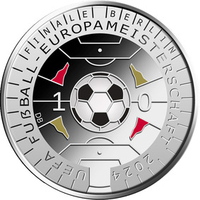
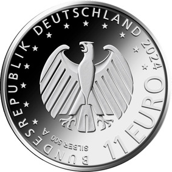

# Bekanntmachung über die Ausprägung von deutschen Euro-Gedenkmünzen im Nennwert von 11 Euro (Gedenkmünze "UEFA Fußball-Europameisterschaft 2024") (Münz11EuroBek 2024-02-20)

Ausfertigungsdatum
:   2024-02-20

Fundstelle
:   BGBl I: 2024, Nr. 90

## (XXXX)

Gemäß den §§ 2, 4 und 5 des Münzgesetzes vom 16. Dezember 1999 (BGBl.
I S. 2402) hat die Bundesregierung beschlossen, eine 11-Euro-
Sammlermünze „UEFA Fußball-Europameisterschaft 2024“ prägen zu lassen.
Die Münze thematisiert eines der international populärsten sportlichen
Großereignisse, die Fußball-Europameisterschaft, die im Jahr 2024 –
erstmalig nach der Wiedervereinigung – in der Bundesrepublik
Deutschland ausgetragen wird.

Die Münze wird von der Staatlichen Münze Berlin geprägt (Prägezeichen
A). Sie besteht aus Silber (Ag 500) mit einer Masse von 14 Gramm und
einem Durchmesser von 30 Millimetern.

Der Entwurf der Bildseite stammt von dem Künstler Detlef Behr aus
Köln. Sie greift die ikonische Dacharchitektur des Berliner
Olympiastadions auf, in dem das Endspiel stattfinden wird. Im Zentrum
steht der Fußball, umrahmt von einem stilisierten Spielfeld inklusive
der Eckfahnen. Die Verwendung der Farben Schwarz, Rot, Gold verweist
auf das Gastgeberland. Die im Entwurf gezeigte „Eins“ und „Null“
können symbolisch für ein Spielergebnis oder für die zehn
Austragungsorte stehen.

Die Wertseite wurde von dem Künstler Lorenz Crössmann aus Berlin
gestaltet. Sie enthält einen Adler, den Schriftzug „BUNDESREPUBLIK
DEUTSCHLAND“, Wertziffer und Wertbezeichnung, die Jahreszahl 2024, die
zwölf Europasterne, das Münzzeichen „A“ sowie die Angabe „SILBER 500“.

Der glatte Münzrand enthält in vertiefter Prägung die Inschrift:

„VEREINT IM HERZEN EUROPAS*             “.

## Schlussformel

Der Bundesminister der Finanzen

## (XXXX)

(Fundstelle: BGBl. 2024 I Nr. 90, S. 2)

*    *        
    *        

