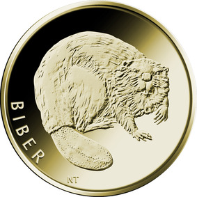
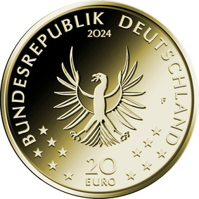

# Bekanntmachung über die Ausprägung von deutschen Euro-Gedenkmünzen im Nennwert von 20 Euro (Goldmünze „Biber“) (Münz20EuroBek 2024-02-20)

Ausfertigungsdatum
:   2024-02-20

Fundstelle
:   BGBl I: 2024, Nr. 80

## (XXXX)

Gemäß den §§ 2, 4 und 5 des Münzgesetzes vom 16. Dezember 1999 (BGBl. I S. 2402) hat die Bundesregierung beschlossen, eine 20-Euro-Goldmünze „Biber“ prägen zu lassen. Die Münze ist Teil der Serie „Rückkehr der Wildtiere“, bei der im Zeitraum 2022 bis 2027 jährlich eine Münze erscheint. Die Serie stellt insbesondere solche Tiere in den Fokus, die in der Vergangenheit in Deutschland schon fast ausgerottet waren und zwischenzeitlich – auch infolge von Arten- und Naturschutzmaßnahmen – wieder zurückgekehrt sind.

Die Münze wird zu gleichen Teilen in den Münzstätten Berlin (Münzzeichen „A“), München (Münzzeichen „D“), Stuttgart (Münzzeichen „F“), Karlsruhe (Münzzeichen „G“) und Hamburg (Münzzeichen „J“) geprägt.

Sie besteht aus Gold mit einem Feingehalt von 999,9 Tausendteilen (Feingold), hat einen Durchmesser von 17,5 Millimetern und eine Masse von 3,89 Gramm. Der Münzrand ist geriffelt.

Der Entwurf stammt von der Künstlerin Natalie Tekampe aus Egenhofen. Die Bildseite zeigt Deutschlands größtes Nagetier in einer sehr naturgetreuen Darstellung. Das Tier blickt den Betrachter direkt an und macht einen wilden und souveränen Eindruck. Sein dichtes Fell ist im Bereich des vorderen Rumpfes und insbesondere am Kopf sehr plastisch ausgearbeitet. Markant ist auch der dargestellte Schwanz, die sogenannte Kelle. Außerdem sind die zum Fassen der Zweige oder auch zum Graben genutzten Vorderpfoten detailreich umgesetzt. Der dem abgerundeten Körper angepasste Schriftzug „BIBER“ komplettiert den Gesamteindruck.

Die locker gestaltete Wertseite mit dem Adler korrespondiert mit der Bildseite. Sie enthält ferner den Schriftzug „BUNDESREPUBLIK DEUTSCHLAND“, die zwölf Europasterne, die Wertziffer, die Wertbezeichnung, die Jahreszahl „2024“ und – je nach Münzstätte – das Münzzeichen „A“, „D“, „F“, „G“ oder „J“.

## Schlussformel

Der Bundesminister der Finanzen

## (XXXX)

(Fundstelle: BGBl. 2024 I Nr. 80, S. 2)

*    *        
    *        

