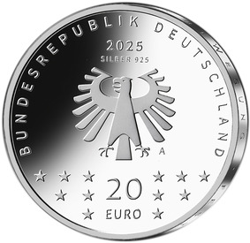

# Bekanntmachung über die Ausprägung von deutschen Euro-Gedenkmünzen im Nennwert von 20 Euro (Gedenkmünze „75. Berlinale“) (Münz20EuroBek 2025-04-22)

Ausfertigungsdatum
:   2025-04-22

Fundstelle
:   BGBl. I: 2025, Nr. 121

## (XXXX)

Gemäß den §§ 2, 4 und 5 des Münzgesetzes vom 16. Dezember 1999 (BGBl. I S. 2402) hat die Bundesregierung beschlossen, zum Thema „75. Berlinale“ eine deutsche Euro-Gedenkmünze im Nennwert von 20 Euro prägen zu lassen. Die Münze würdigt die Internationalen Filmfestspiele Berlin, kurz Berlinale, eines der größten Publikumsfilmfestivals der Welt, das im Jahr 2025 zum 75. Mal stattfindet.

Die Prägung erfolgt durch die Staatliche Münze Berlin (Prägezeichen A).

Der Entwurf stammt von der Künstlerin Anna Steinmann aus Berlin.

Die Bildseite bietet einen Blick aus der Perspektive des Publikums in Richtung Leinwand. In einem vollbesetzten Kinosaal ist der Spot auf das rot kolorierte Berlinale Logo gerichtet. Der Bär und die Zahl 75 erstrahlen im Zentrum des Scheinwerferlichts. Der Schriftzug „Berlinale“ durchbricht den Lichtkegel. Der linear gearbeitete Entwurf besticht durch Tiefenwirkung und Eleganz.

Die Wertseite zeigt einen Adler, den Schriftzug „BUNDESREPUBLIK DEUTSCHLAND“, Wertziffer und Wertbezeichnung, das Prägezeichen „A“ der Staatlichen Münze Berlin, die Jahreszahl 2025 sowie die zwölf Europasterne. Zusätzlich ist die Angabe „SILBER 925“ aufgeprägt.

Der glatte Münzrand enthält in vertiefter Prägung die Inschrift:

„FESTIVAL IN BEWEGUNG*              FESTIVAL IN BEWEGUNG*             “

Die Münze besteht aus einer Legierung von 925 Tausendteilen Silber und 75 Tausendteilen Kupfer, hat einen Durchmesser von 32,5 Millimetern und eine Masse von 18 Gramm. Das Gepräge auf beiden Seiten ist erhaben und wird von einem schützenden, glatten Randstab umgeben.

## Schlussformel

Der Bundesminister der Finanzen

## Anlage

(Fundstelle: BGBl. 2025 I Nr. 121, S. 2)

*    *        
    *        

