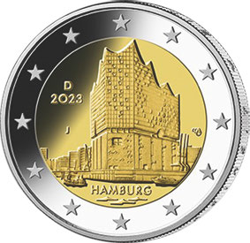

# Bekanntmachung über die Ausprägung von deutschen Euro-Gedenkmünzen im Nennwert von 2 Euro (Gedenkmünze „Hamburg“) (Münz2EuroBek 2023-03-30)

Ausfertigungsdatum
:   2023-03-30

Fundstelle
:   BGBl I: 2023, Nr. 130

## (XXXX)

Gemäß den §§ 2, 4 und 5 des Münzgesetzes vom 16. Dezember 1999 (BGBl. I S. 2402) hat die Bundesregierung beschlossen, zum Thema „Hamburg“ eine deutsche Euro-Gedenkmünze im Nennwert von 2 Euro prägen zu lassen. Die Münze bildet den Auftakt der Serie „Bundesländer II“, bei der jährlich ein Land durch die Ausgabe einer 2-Euro-Gedenkmünze mit einem prägnanten Wahrzeichen gewürdigt werden soll. Die Münze wird ab dem 24. Januar 2023 in den Verkehr gebracht.

Die für den Umlauf bestimmte Auflage der Münze beträgt 30 Millionen Stück.

Der Entwurf der Münze stammt von dem Künstler Michael Otto aus Rodenbach.

Die nationale Seite zeigt die Elbphilharmonie, das neue Wahrzeichen der Freien und Hansestadt Hamburg. Die Länderbezeichnung „Hamburg“ verknüpft das abgebildete Bauwerk mit dem Bundesland. Auf dem inneren Kern befinden sich ferner das Ausgabejahr 2023, die Kennzeichnung „D“ für das Ausgabeland Bundesrepublik Deutschland, das Münzzeichen der jeweiligen Prägestätte („A“, „D“, „F“, „G“ oder „J“) sowie die Initialen des Künstlers. Der äußere Ring der nationalen Seite zeigt die zwölf Europasterne.

Die Wertseite der Münze, die Randschrift (Schriftzug „EINIGKEIT UND RECHT UND FREIHEIT“ sowie eine stilisierte Darstellung des Bundesadlers) und die technischen Parameter entsprechen der 2-Euro-Umlaufmünze.

## Schlussformel

Der Bundesminister der Finanzen

## (XXXX)

(Fundstelle: BGBl. 2023 I Nr. 130, S. 2)

*    *        
    *        

