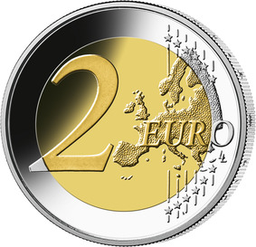

# Bekanntmachung über die Ausprägung von deutschen Euro-Gedenkmünzen im Nennwert von 2 Euro (Gedenkmünze "175. Jubiläum Paulskirchenverfassung") (Münz2EuroBek 2024-02-20/2)

Ausfertigungsdatum
:   2024-02-20

Fundstelle
:   BGBl I: 2024, Nr. 79

## (XXXX)

Gemäß den §§ 2, 4 und 5 des Münzgesetzes vom 16. Dezember 1999 (BGBl. I S. 2402) hat die Bundesregierung beschlossen, zum Thema „175. Jubiläum Paulskirchenverfassung“ eine deutsche Euro-Gedenkmünze im Nennwert von 2 Euro prägen zu lassen.

Der Entwurf der Münze stammt von dem Künstler Bodo Broschat aus Berlin.

Die nationale Seite zeigt im Vordergrund eine perspektivische Darstellung der Paulskirche im Moment des Einzugs der Abgeordneten der verfassungsgebenden Nationalversammlung. Dahinter wird das papierne Verfassungsdokument mit Schreibfeder dargestellt, bekränzt durch die drei Allegorien Einigkeit, Recht und Freiheit sowie durch die Trikolore aus Schwarz, Rot und Gold.

Der innere Teil der Münze trägt ferner den Schriftzug „PAULSKIRCHENVERFASSUNG 1849“ sowie im unteren Bereich das Ausgabejahr „2024“, die Länderkennung „D“ für das Ausgabeland Deutschland, das Prägezeichen der jeweiligen Münzstätte („A“, „D“, „F“, „G“ oder „J“) und die Initialen des Künstlers. Auf dem Außenring der nationalen Seite sind die zwölf Europasterne angeordnet.

Die Wertseite der Münze, die Randschrift (Schriftzug „EINIGKEIT UND RECHT UND FREIHEIT“ sowie eine stilisierte Darstellung des Bundesadlers) und die technischen Parameter entsprechen der 2-Euro-Umlaufmünze.

## Schlussformel

Der Bundesminister der Finanzen

## (XXXX)

(Fundstelle: BGBl. 2024 I Nr. 79, S. 2)

*    *        
    *        

