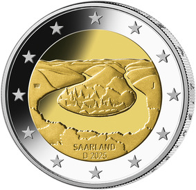
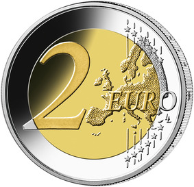

# Bekanntmachung über die Ausprägung von deutschen Euro-Gedenkmünzen im Nennwert von 2 Euro (Gedenkmünze „Saarland“) (Münz2EuroBek 2025-04-22)

Ausfertigungsdatum
:   2025-04-22

Fundstelle
:   BGBl. I: 2025, Nr. 120

## (XXXX)

Gemäß den §§ 2, 4 und 5 des Münzgesetzes vom 16. Dezember 1999 (BGBl. I S. 2402) hat die Bundesregierung beschlossen, zum Thema „Saarland“ eine deutsche Euro-Gedenkmünze im Nennwert von 2 Euro prägen zu lassen. Die Münze ist die dritte Emission im Rahmen der im Jahr 2023 begonnenen Serie „Bundesländer II“, bei der jährlich ein Land durch die Ausgabe einer 2-Euro-Gedenkmünze mit einem prägnanten Wahrzeichen gewürdigt werden soll.

Der Entwurf der Münze stammt von dem Künstler Carsten Wolff aus Frankfurt/Main.

Die nationale Seite zeigt die kunstvoll gestaltete Saarschleife. Der Entwurf konzentriert sich auf die wesentlichen Elemente des Flussverlaufs. Die bewaldeten Hügel der malerischen Saarschleife werden durch die fließende Form des Flusses abstrahiert, wodurch die Landschaft in der Dynamik und Bewegung eingefangen wird. Aus der Vogelperspektive zeigt sich die charakteristische Wasserstraße, die sich in sanften Bögen durch die Hügel zieht und in der Ferne zu verschwinden scheint. Der Schriftzug „Saarland“ ist in den Vordergrund eingelassen und hebt sich dezent hervor. Auf dem inneren Kern befinden sich ferner die Angabe „Saarland“ mit dem Ausgabejahr 2025 und mit der Kennzeichnung „D“ für das Ausgabeland Bundesrepublik Deutschland sowie das Münzzeichen der jeweiligen Prägestätte („A“, „D“, „F“, „G“ oder „J“) und die Initialen des Künstlers. Der äußere Ring der nationalen Seite zeigt die zwölf Europasterne.

Die Wertseite der Münze, die Randschrift (Schriftzug „EINIGKEIT UND RECHT UND FREIHEIT“ sowie eine stilisierte Darstellung des Bundesadlers) und die technischen Parameter entsprechen der 2-Euro-Umlaufmünze.

## Schlussformel

Der Bundesminister der Finanzen

## Anlage

(Fundstelle: BGBl. 2025 I Nr. 120, S. 2)

*    *        
    *        

