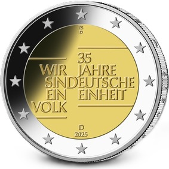

# Bekanntmachung über die Ausprägung von deutschen Euro-Gedenkmünzen im Nennwert von 2 Euro (Gedenkmünze „35 Jahre Deutsche Einheit“) (Münz2EuroBek 2025-11-06)

Ausfertigungsdatum
:   2025-11-06

Fundstelle
:   BGBl. I: 2025, Nr. 271

## (XXXX)

Gemäß den §§ 2, 4 und 5 des Münzgesetzes vom 16. Dezember 1999 (BGBl. I S. 2402) hat die Bundesregierung beschlossen, zum Thema „35 Jahre Deutsche Einheit“ eine deutsche Euro-Gedenkmünze im Nennwert von 2 Euro prägen zu lassen. Die Münze bildet den Auftakt einer mehrjährigen Serie „Einigkeit und Recht und Freiheit“ (2025 bis 2031), die zur Würdigung von Politikerinnen und Politikern erscheinen soll, die die Geschichte der Bundesrepublik Deutschland in besonderer Weise geprägt haben.

Der Entwurf stammt von dem Künstler Thomas Serres aus Hattingen. Der vorliegende Entwurf zum Thema „35 Jahre Deutsche Einheit“ zeigt eine typografische Komposition: An einer leicht nach links verschobenen Längsachse befindet sich auf der linken Seite rechtsbündig untereinander der Schriftzug „Wir sind ein Volk“. Auf der rechten Seite linksbündig steht untereinander „35 Jahre Deutsche Einheit“. Beide Blöcke sind entlang der Mittelachse leicht verschoben und werden jeweils oben und unten durch eine horizontale Linie gehalten. Die Verbindung wird durch ein leicht vergrößertes D in der Mitte geschaffen. Der Entwurf besticht durch die klare Botschaft: Gleichwertig zum titelgebenden Ergebnis „35 Jahre Deutsche Einheit“ hebt die zweite Botschaft „Wir sind ein Volk“ die herausragende Bedeutung der ostdeutschen Bevölkerung im Prozess der Wiedervereinigung hervor.

Der innere Teil der Münze zeigt ferner im oberen Bereich die Initialen des Künstlers Thomas Serres (TS) und darunter das Prägezeichen der jeweiligen Münzstätte („A“, „D“, „F“, „G“ oder „J“). Im unteren Bereich sind das Ausgabejahr „2025“ sowie darüber die Länderkennung „D“ für das Ausgabeland Deutschland angeordnet. Der äußere Ring der Münze zeigt die 12 Sterne der Europaflagge.

Der Münzrand der deutschen 2-Euro-Gedenkmünze enthält in vertiefter Prägung unverändert die Inschrift:

„EINIGKEIT UND RECHT UND FREIHEIT“

## Schlussformel

Der Bundesminister der Finanzen

## Anlage

(Fundstelle: BGBl. 2025 I Nr. 271, S. 2)

*    *        
    *        

