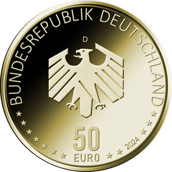

# Bekanntmachung über die Ausprägung von deutschen Euro-Gedenkmünzen im Nennwert von 50 Euro (Goldmünze „Mobilität“) (Münz50EuroBek 2024-02-20)

Ausfertigungsdatum
:   2024-02-20

Fundstelle
:   BGBl I: 2024, Nr. 89

## (XXXX)

Gemäß den §§ 2, 4 und 5 des Münzgesetzes vom 16. Dezember 1999 (BGBl. I S. 2402) hat die Bundesregierung beschlossen, eine 50-Euro-Goldmünze „Mobilität“ prägen zu lassen. Die Münze ist die zweite Ausgabe im Rahmen der fünfteiligen Serie „Deutsches Handwerk“, bei der im Zeitraum 2023 bis 2027 jährlich eine Münze erscheint. Die Serie würdigt das Handwerk als einen der wichtigsten und vielseitigsten Wirtschaftsbereiche der Bundesrepublik Deutschland.

Die Münze wird zu gleichen Teilen in den Münzstätten Berlin (Prägezeichen „A“), München (Prägezeichen „D“), Stuttgart (Prägezeichen „F“), Karlsruhe (Prägezeichen „G“) und Hamburg (Prägezeichen „J“) geprägt.

Sie besteht aus Gold mit einem Feingehalt von 999,9 Tausendteilen (Feingold), hat einen Durchmesser von 22 Millimetern und eine Masse von 7,78 Gramm.

Der Entwurf der Münze stammt von der Künstlerin Stefanie Radtke aus Leipzig. Die Bildseite schaut aus der Perspektive des Handwerks in die Zukunft der Mobilität. Ausgehend vom universellen Sechskant wird das Symbol des Sechsecks auf die modulare und vernetzte Mobilität übertragen. Das Logo des Handwerks wird durch die besondere Darstellung in Form eines neuronalen Netzes zu einer wissenden Hand. Das Handwerk schraubt bildlich übersetzt an zentraler Stelle am Gelingen der Mobilitätswende.

Auf der Wertseite präsentiert sich ein Adler, der sich mit seinem sechseckigen Umriss auf die Bildseite bezieht. Sie zeigt ferner den Schriftzug „BUNDESREPUBLIK DEUTSCHLAND“, Wertziffer und Wertbezeichnung, die Jahreszahl „2024“, die zwölf Europasterne sowie – je nach Prägestätte – das Prägezeichen „A“, „D“, „F“, „G“ oder „J“.

Der Münzrand wird geriffelt ausgeführt.

## Schlussformel

Der Bundesminister der Finanzen

## (XXXX)

(Fundstelle: BGBl. 2024 I Nr. 89, S. 2)

*    *        
    *        

