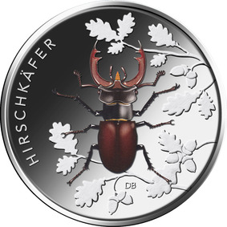
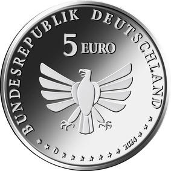

# Bekanntmachung über die Ausprägung von deutschen Euro-Gedenkmünzen im Nennwert von 5 Euro (Gedenkmünze „Hirschkäfer“) (Münz5EuroBek 2024-02-20/2)

Ausfertigungsdatum
:   2024-02-20

Fundstelle
:   BGBl I: 2024, Nr. 87

## (XXXX)

Gemäß den §§ 2, 4 und 5 des Münzgesetzes vom 16. Dezember 1999 (BGBl. I S. 2402) hat die Bundesregierung beschlossen, eine 5-Euro-Sammlermünze „Hirschkäfer“ prägen zu lassen. Die Münze ist Teil der Serie „Wunderwelt Insekten“, bei der im Zeitraum 2022 bis 2024 insgesamt neun Münzen mit teilkolorierten Motiven erscheinen. Die Serie stellt, auch vor dem Hintergrund aktueller Entwicklungen (Insektensterben), eine besondere Tiergruppe in den Fokus, die einen bedeutsamen Teil unseres Naturerbes ausmacht.

Die Prägung erfolgt durch das Bayerische Hauptmünzamt in München (Prägezeichen D).

Die Münze besteht aus einer Kupfer-Nickel-Legierung, hat einen Durchmesser von 27,25 Millimetern und eine Masse von 9,68 Gramm. Das Gepräge auf beiden Seiten ist erhaben und wird von einem schützenden, glatten Randstab umgeben.

Der Künstler Detlef Behr aus Köln hat die Bildseite entworfen. Sie zeigt zentral ein idealtypisches Hirschkäfer-Männchen im Stil einer naturwissenschaftlichen Illustration aus senkrechter Perspektive. Durch die typische schwarzbraune Kolorierung gelangt der Käfer mit seinem charakteristisch vergrößerten Oberkiefer, den „Mandibeln“, in den visuellen Vordergrund. Im Hintergrund sind idealisierte Eichenblätter und Eicheln dargestellt. Sie geben mit ihrer leichten Erhabenheit einen dezenten Hinweis auf das Habitat des Käfers und die hohe Bedeutung von Eichen für seine Larvalentwicklung. Die typografische Benennung „HIRSCHKÄFER“ findet sich als serifenloser Versalschriftzug am linken Rand der Münze.

Die Wertseite, die für alle Münzen der Serie verwendet wird, wurde von dem Künstler Andre Witting aus Berlin gestaltet. Sie zeigt einen Adler, den Schriftzug „BUNDESREPUBLIK DEUTSCHLAND“, Wertziffer und Wertbezeichnung, die Jahreszahl „2024“, die zwölf Europasterne sowie das Prägezeichen „D“.

Der glatte Münzrand enthält in vertiefter Prägung die Inschrift:

„WUNDERWELT INSEKTEN*             “.

## Schlussformel

Der Bundesminister der Finanzen

## (XXXX)

(Fundstelle: BGBl. 2024 I Nr. 87, S. 2)

*    *        
    *        

