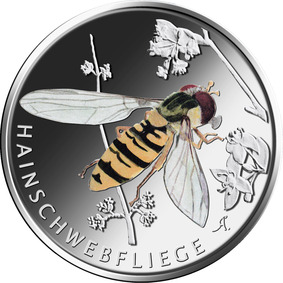
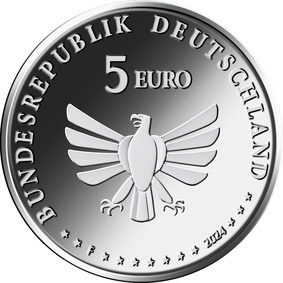

# Bekanntmachung über die Ausprägung von deutschen Euro-Gedenkmünzen im Nennwert von 5 Euro (Gedenkmünze „Hainschwebfliege“) (Münz5EuroBek 2024-02-20/3)

Ausfertigungsdatum
:   2024-02-20

Fundstelle
:   BGBl I: 2024, Nr. 88

## (XXXX)

Gemäß den §§ 2, 4 und 5 des Münzgesetzes vom 16. Dezember 1999 (BGBl. I S. 2402) hat die Bundesregierung beschlossen, eine 5-Euro-Sammlermünze „Hainschwebfliege“ prägen zu lassen. Die Münze ist Teil der Serie „Wunderwelt Insekten“, bei der im Zeitraum 2022 bis 2024 insgesamt neun Münzen mit teilkolorierten Motiven erscheinen. Die Serie stellt, auch vor dem Hintergrund aktueller Entwicklungen (Insektensterben), eine besondere Tiergruppe in den Fokus, die einen bedeutsamen Teil unseres Naturerbes ausmacht.

Die Prägung erfolgt durch die Staatlichen Münzen Baden-Württemberg, Prägestätte Stuttgart (Prägezeichen F).

Die Münze besteht aus einer Kupfer-Nickel-Legierung, hat einen Durchmesser von 27,25 Millimetern und eine Masse von 9,68 Gramm. Das Gepräge auf beiden Seiten ist erhaben und wird von einem schützenden, glatten Randstab umgeben.

Der Entwurf der Bildseite stammt von der Künstlerin Anna Martha Napp aus Maßlow. Sie zeigt eine Hainschwebfliege, die sich einer Blüte nähert und im Begriff ist, auf dieser zu landen und zu fressen. Das Insekt ist zentral ins Münzrund gesetzt und wird in schräger Aufsicht gezeigt. Die Farbigkeit ist eher zurückhaltend; die Flügel werden transparent dargestellt. Die Umschrift „HAINSCHWEBFLIEGE“ ist in klaren Versalien gehalten.

Die Wertseite, die für alle Münzen der Serie verwendet wird, wurde von dem Künstler Andre Witting aus Berlin gestaltet. Sie zeigt einen Adler, den Schriftzug „BUNDESREPUBLIK DEUTSCHLAND“, Wertziffer und Wertbezeichnung, die Jahreszahl „2024“, die zwölf Europasterne sowie das Prägezeichen „F“.

Der glatte Münzrand enthält in vertiefter Prägung die Inschrift:

„WUNDERWELT INSEKTEN*             “.

## Schlussformel

Der Bundesminister der Finanzen

## (XXXX)

(Fundstelle: BGBl. 2024 I Nr. 88, S. 2)

*    *        
    *        

