# Neue-psychoaktive-Stoffe-Gesetz (NpSG)

Ausfertigungsdatum
:   2016-11-21

Fundstelle
:   BGBl I: 2016, 2615

Zuletzt geändert durch
:   Art. 1 V v. 1.12.2025 I Nr. 292

Änderung durch
:   Art. 1 G v. 7.1.2026 I Nr. 2 textlich nachgewiesen, dokumentarisch noch nicht abschließend bearbeitet

## § 1 Anwendungsbereich

(1) Dieses Gesetz ist anzuwenden auf neue psychoaktive Stoffe im Sinne des § 2 Nummer 1.

(2) Dieses Gesetz ist nicht anzuwenden auf

1.  Betäubungsmittel im Sinne des § 1 Absatz 1 des Betäubungsmittelgesetzes,

2.  Arzneimittel im Sinne des § 2 Absatz 1, 2, 3a und 4 Satz 1 des Arzneimittelgesetzes sowie

3.  Tierarzneimittel im Sinne des Artikels 4 Nummer 1 der Verordnung (EU) 2019/6 des Europäischen Parlaments und des Rates vom 11. Dezember 2018 über Tierarzneimittel und zur Aufhebung der Richtlinie 2001/82/EG (ABl. L 4 vom 7.1.2019, S. 43; L 163 vom 20.6.2019, S. 112; L 326 vom 8.10.2020, S. 15; L 241 vom 8.7.2021, S. 17).

## § 2 Begriffsbestimmungen

Im Sinne dieses Gesetzes ist

1.  neuer psychoaktiver Stoff ein Stoff oder eine Zubereitung eines Stoffes aus einer der in der Anlage genannten Stoffgruppen;

2.  Zubereitung ohne Rücksicht auf den Aggregatzustand ein Stoffgemisch oder die Lösung eines Stoffes oder mehrerer Stoffe außer den natürlich vorkommenden Gemischen und Lösungen;

3.  Herstellen das Gewinnen, das Anfertigen, das Zubereiten, das Be- oder Verarbeiten, das Reinigen, das Umwandeln, das Abpacken und das Umfüllen einschließlich Abfüllen;

4.  Inverkehrbringen das Vorrätighalten zum Verkauf oder zu sonstiger Abgabe sowie das Feilhalten, das Feilbieten, die Abgabe und das Überlassen zum unmittelbaren Verbrauch an andere.

## § 3 Unerlaubter Umgang mit neuen psychoaktiven Stoffen

(1) Es ist verboten, mit einem neuen psychoaktiven Stoff Handel zu treiben, ihn in den Verkehr zu bringen, ihn herzustellen, ihn in den, aus dem oder durch den Geltungsbereich dieses Gesetzes zu verbringen, ihn zu erwerben, ihn zu besitzen oder ihn einem anderen zu verabreichen.

(2) Vom Verbot ausgenommen sind

1.  nach dem jeweiligen Stand von Wissenschaft und Technik anerkannte Verwendungen eines neuen psychoaktiven Stoffes zu gewerblichen, industriellen oder wissenschaftlichen Zwecken und

2.  Verwendungen eines neuen psychoaktiven Stoffes durch Bundes- oder Landesbehörden für den Bereich ihrer dienstlichen Tätigkeit sowie durch die von ihnen mit der Untersuchung von neuen psychoaktiven
    Stoffen                    beauftragten Behörden.

(3) In den Fällen des Absatzes 1 erfolgen die Sicherstellung, die Verwahrung und die Vernichtung von neuen psychoaktiven Stoffen nach den §§ 47 bis 50 des Bundespolizeigesetzes und den Vorschriften der Polizeigesetze der Länder.

(4) Unbeschadet des Absatzes 3 können die Zollbehörden im Rahmen ihrer Aufgabenwahrnehmung nach § 1 Absatz 3 des Zollverwaltungsgesetzes Waren, bei denen Grund zu der Annahme besteht, dass es sich um neue psychoaktive Stoffe handelt, die entgegen Absatz 1 in den, aus dem oder durch den Geltungsbereich dieses Gesetzes verbracht worden sind oder verbracht werden sollen, sicherstellen. Die §§ 48 bis 50 des Bundespolizeigesetzes gelten entsprechend. Kosten, die den Zollbehörden durch die Sicherstellung und Verwahrung entstehen, sind vom Verantwortlichen zu tragen; die §§ 17 und 18 des Bundespolizeigesetzes gelten entsprechend. Mehrere Verantwortliche haften als Gesamtschuldner. Die Kosten können im Verwaltungsvollstreckungsverfahren beigetrieben werden.

## § 4 Strafvorschriften

(1) Mit Freiheitsstrafe bis zu drei Jahren oder mit Geldstrafe wird bestraft, wer entgegen § 3 Absatz 1

1.  mit einem neuen psychoaktiven Stoff Handel treibt, ihn in den Verkehr bringt oder ihn einem anderen verabreicht oder

2.  einen neuen psychoaktiven Stoff zum Zweck des Inverkehrbringens

    a)  herstellt oder

    b)  in den Geltungsbereich dieses Gesetzes verbringt.

(2) Der Versuch ist strafbar.

(3) Mit Freiheitsstrafe von einem Jahr bis zu zehn Jahren wird bestraft, wer

1.  in den Fällen

    a)  des Absatzes 1 gewerbsmäßig oder als Mitglied einer Bande handelt, die sich zur fortgesetzten Begehung solcher Taten verbunden hat, oder

    b)  des Absatzes 1 Nummer 1 als Person über
        21 Jahre                          einen neuen psychoaktiven Stoff an eine Person unter 18 Jahren abgibt oder ihn ihr verabreicht oder zum unmittelbaren Verbrauch überlässt oder

2.  durch eine in Absatz 1 genannte Handlung

    a)  die Gesundheit einer großen Zahl von Menschen gefährdet oder

    b)  einen anderen der Gefahr des Todes oder einer schweren Schädigung an Körper oder Gesundheit aussetzt.

(4) In minder schweren Fällen des Absatzes 3 ist die Strafe Freiheitsstrafe von drei Monaten bis zu fünf Jahren.

(5) Handelt der Täter in den Fällen des Absatzes 3 Nummer 1 Buchstabe b oder Nummer 2 in Verbindung mit Absatz 1 Nummer 1 fahrlässig, ist die Strafe Freiheitsstrafe bis zu drei Jahren oder Geldstrafe.

(6) Handelt der Täter in den Fällen des Absatzes 1 Nummer 1 fahrlässig, ist die Strafe Freiheitsstrafe bis zu einem Jahr oder Geldstrafe.

## § 5 Einziehung

Gegenstände, auf die sich eine Straftat nach § 4 bezieht, können eingezogen werden. § 74a des Strafgesetzbuches ist anzuwenden.

## § 6 Datenübermittlung

Das Zollkriminalamt darf zu Straftaten nach § 4 Informationen, einschließlich personenbezogener Daten nach der aufgrund des § 7 Absatz 11 des Bundeskriminalamtgesetzes erlassenen Rechtsverordnung, dem Bundeskriminalamt zur Erfüllung von dessen Aufgaben als Zentralstelle übermitteln, soweit Zwecke des Strafverfahrens dem nicht entgegenstehen. Übermittlungen nach Satz 1 sind auch zulässig, sofern sie Daten betreffen, die dem Steuergeheimnis nach § 30 der Abgabenordnung unterliegen. Übermittlungsbefugnisse nach anderen Rechtsvorschriften bleiben unberührt.

## § 7 Verordnungsermächtigung

Das Bundesministerium für Gesundheit wird ermächtigt, durch Rechtsverordnung, die der Zustimmung des Bundesrates bedarf, im Einvernehmen mit dem Bundesministerium des Innern, für Bau und Heimat, mit dem Bundesministerium der Justiz und für Verbraucherschutz und mit dem Bundesministerium der Finanzen und nach Anhörung von Sachverständigen die Liste der Stoffgruppen in der Anlage zu ändern, wenn dies nach wissenschaftlicher Erkenntnis wegen der Wirkungsweise von psychoaktiv wirksamen Stoffen, wegen des Ausmaßes ihrer missbräuchlichen Verwendung und wegen der unmittelbaren oder mittelbaren Gefährdung der Gesundheit erforderlich ist.

## Anlage

(Fundstelle: BGBl. 2025 I Nr. 292, S. 3 – 21)

**Vorbemerkungen**

Die Stoffgruppendefinitionen der Nummern 1 bis 9 schließen alle denkbaren geladenen Formen, Stereoisomere, Salze und isotopensubstituierte Verbindungen eines erfassten Stoffes ein. Die festgelegten Molekülmassenbegrenzungen gelten bei geladenen Formen und Salzen nur für den Molekülteil ausschließlich des Gegen-Ions. Ein Wasserstoffatom ist ein möglicher Substituent.

**1.** Von 2-Phenethylamin abgeleitete Verbindungen ****

    Eine von 2-Phenethylamin abgeleitete Verbindung ist jede chemische Verbindung, die von einer 2-Phenylethan-1-amin-Grundstruktur abgeleitet werden kann (ausgenommen 2-Phenethylamin selbst), eine maximale Molekülmasse von 500 u hat und dem nachfolgend beschriebenen modularen Aufbau aus Strukturelement A und Strukturelement B entspricht.

    *        *            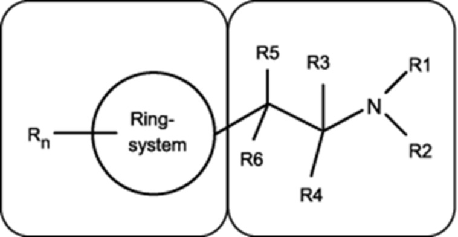

    *        *   **Strukturelement A**

        *   **Strukturelement B**

    Dies schließt chemische Verbindungen mit einer Cathinon-Grundstruktur (2-Amino-1-phenyl-1-propanon) ein:

    *        *            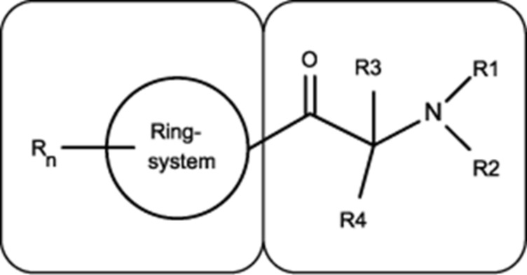

    *        *   **Strukturelement A**

        *   **Strukturelement B**

    Nicht von der Stoffgruppe Nummer 1 erfasst werden Stoffe, die zwar eine Definition dieser Stoffgruppe erfüllen, jedoch zugleich eine in den Stoffgruppendefinitionen der Nummern 2 bis 9 genannte Kern- oder Grundstruktur besitzen und von der Stoffgruppendefinition der jeweiligen Nummer nicht erfasst werden.

**1.1** **Strukturelement A**

    Für das Strukturelement A sind die folgenden Ringsysteme eingeschlossen, wobei sich das Strukturelement B an jeder Position des Strukturelements A befinden kann: Phenyl‑, Furanyl‑, Pyrrolyl‑, Thienyl‑, Pyridyl‑, Cyclopentyl‑ und Cyclohexylring.

    *        *            
        *            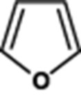
        *            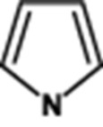
        *            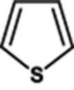

    *        *   Phenyl-

        *   Furanyl-

        *   Pyrrolyl-

        *   Thienyl-

    *        *            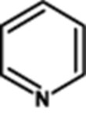
        *            
        *            

    *        *   Pyridyl-

        *   Cyclopentyl-

        *   Cyclohexyl-

    Darüber hinaus kann das Strukturelement A aus den folgenden bizyklischen oder trizyklischen Systemen bestehen, wobei sich das Strukturelement B an jeder Position des bizyklischen oder trizyklischen Systems befinden kann:

    *        *            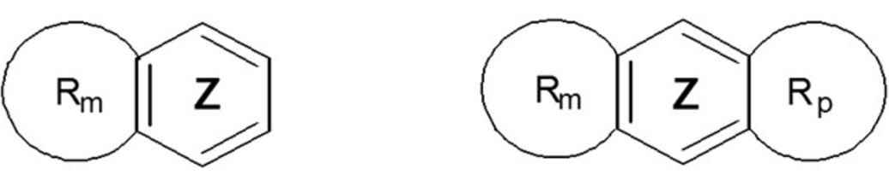

   Die anellierten Ringe R
    m                    und R
    p                    können aus gesättigten, ungesättigten oder aromatischen Ringstrukturen mit vier bis acht Ringatomen (inkl. der zwei Kohlenstoffatome des Rings Z) bestehen. Diese Ringe R
    m                    und R
    p                    können neben Kohlenstoff jeweils maximal zwei Atome aus den Elementen Sauerstoff, Stickstoff und Schwefel in beliebiger Kombination im Ring aufweisen. Das Heteroatom/die Heteroatome in den Ringen R
    m                    und R
    p                    dürfen ausschließlich direkt an den Ring Z angebunden sein. Eine mögliche freie Valenz eines Stickstoffatoms in den Ringen R
    m                    und R
    p                    kann ein Wasserstoffatom oder einen Methyl- oder Ethylrest tragen.

    Die Kohlenstoffatome der genannten Ringsysteme des Strukturelements A können an jeder Position mit folgenden Atomen oder Atomgruppen (R
    n                   ) substituiert sein:

    Wasserstoff, Fluor, Chlor, Brom, Iod, Alkyl- (bis C
    8                   ), Alkenyl- (bis C
    8                   ), Alkinyl- (bis C
    8                   ), Alkoxy- (bis C
    7                   ), Carboxy-, Alkylsulfanyl- (bis C
    7                   ) und Nitrogruppen.

    Die aufgeführten Atomgruppen können weiterhin mit beliebigen, chemisch möglichen Kombinationen der Elemente Kohlenstoff, Wasserstoff, Stickstoff, Sauerstoff, Schwefel, Fluor, Chlor, Brom und Iod substituiert sein. Die auf diese Weise entstehenden Substituenten dürfen dabei eine durchgehende Kettenlänge von maximal acht Atomen aufweisen (ohne Mitzählung von Wasserstoffatomen). Atome von Ringstrukturen werden dabei nicht in die Zählung einbezogen.

    Moleküle, bei denen durch R
    n                    zyklische Systeme entstehen, die an das Strukturelement A anelliert sind, werden von der Stoffgruppendefinition nicht erfasst.

**1.2** **Strukturelement B**

    Die 2-Aminoethyl-Seitenkette des Strukturelements B kann mit folgenden Atomen, Atomgruppen oder Ringsystemen substituiert sein:

    a)  R
        1                          und R
        2                          am Stickstoffatom:

        Wasserstoff, Alkyl- (bis C
        6                         ), Cycloalkyl- (Ringgröße bis C
        6                         ), Benzyl-, Alkenyl- (bis C
        6                         ), Alkinyl- (bis C
        6                         ), Alkylcarbonyl- (bis C
        6                         ), Alkyloxycarbonyl- (Alkylrest bis C
        6                         ), Alkylthiocarbonyl- (Alkylrest bis C
        6                         ), Alkylcarbamoyl- (Alkylrest bis C
        6                         ), Arylcarbonyl- (Arylrest bis C
        10                         ), Hydroxy- und Aminogruppen. Ferner sind Stoffe eingeschlossen, bei denen das Stickstoffatom Bestandteil eines nichtaromatischen gesättigten oder ungesättigten zyklischen Systems ist (beispielsweise Pyrrolidinyl-, Piperidinyl-Ringe). Ein Ringschluss des Stickstoffatoms unter Einbeziehung von Teilen des Strukturelements B (Reste R
        3                          bis R
        6                         ) ist möglich. Die dabei entstehende Molekülstruktur muss hinsichtlich der Substituenten auch ohne den erfolgten Ringschluss zum Strukturelement B konform zu Nummer 1.2 Buchstabe a sein. Die dabei entstehenden Ringsysteme können die Elemente Kohlenstoff, Sauerstoff, Schwefel, Stickstoff und Wasserstoff enthalten. Diese Ringsysteme dürfen fünf bis sieben Atome umfassen. Eine Doppelbindung als Brücke zum Strukturelement B ist möglich. Die Reste R
        1                         /R
        2                          können ausschließlich in dem bei einem Ringschluss mit Teilen des Strukturelements B entstehenden Ringsystem als doppelt gebundener Rest (Iminstruktur) vorliegen.

        Ausgenommen von den erfassten Stoffen der Stoffgruppe der von 2-Phenethylamin abgeleiteten Verbindungen sind Verbindungen, bei denen das Stickstoffatom direkt in ein zyklisches System integriert ist, das an das Strukturelement A anelliert ist.

        Die Substituenten R
        1                          und R
        2                          können (bei Ringschlüssen nur nach dem Ringschluss) weiterhin mit beliebigen, chemisch möglichen Kombinationen der Elemente Kohlenstoff, Wasserstoff, Stickstoff, Sauerstoff, Schwefel, Fluor, Chlor, Brom und Iod substituiert sein. Die auf diese Weise entstehenden Substituenten R
        1                         /R
        2                          dürfen dabei eine durchgehende Kettenlänge von maximal zehn Atomen aufweisen (ohne Mitzählung von Wasserstoffatomen). Atome von Ringstrukturen werden dabei nicht in die Zählung einbezogen.

    b)  R
        3                          und R
        4                          am C
        1                         -Atom sowie R
        5                          und R
        6                          am C
        2                         -Atom:

        Wasserstoff, Fluor, Chlor, Brom, Iod, Alkyl- (bis C
        10                         ), Cycloalkyl- (Ringgröße bis C
        10                         ), Benzyl-, Phenyl-, Alkenyl- (bis C
        10                         ), Alkinyl- (bis C
        10                         ), Hydroxy-, Alkoxy- (bis C
        10                         ), Alkylsulfanyl- (bis C
        10                         ) und Alkyloxycarbonylgruppen (Alkylrest bis C
        10                         ), einschließlich der chemischen Verbindungen, bei denen Substitutionen zu einem Ringschluss mit dem Strukturelement A oder zu Ringsystemen, die die Reste R
        3                          bis R
        6                          enthalten, führen können. Diese Ringsysteme dürfen vier bis sechs Atome umfassen.

        Die aufgeführten Atomgruppen und Ringsysteme können zudem mit beliebigen, chemisch möglichen Kombinationen der Elemente Kohlenstoff, Wasserstoff, Stickstoff, Sauerstoff, Schwefel, Fluor, Chlor, Brom und Iod substituiert sein. Die auf diese Weise entstehenden Substituenten R
        3                          bis R
        6                          dürfen dabei eine durchgehende Kettenlänge von maximal zwölf Atomen aufweisen (ohne Mitzählung von Wasserstoffatomen). Atome von Ringstrukturen werden dabei nicht in die Zählung einbezogen.

        Sofern die Reste R
        3                          bis R
        6                          Bestandteil eines Ringsystems sind, das das Stickstoffatom des Strukturelements B enthält, gelten für weitere Substituenten die Beschränkungen gemäß Buchstabe a.

    c)  Carbonylgruppe in beta-Stellung zum Stickstoffatom (sogenannte beta-keto-Derivate/Cathinone, siehe Abbildung der Cathinon-Grundstruktur unter Nummer 1: R
        5                          und R
        6                          am C
        2                         -Atom: Carbonylgruppe (C=O)).

**2.** Cannabimimetika/synthetische Cannabinoide ****

**2.1** **Von Indol, Indolizin, Pyrrol, Pyrazol und Chinolon abgeleitete Verbindungen**

    Ein Cannabimimetikum bzw. ein synthetisches Cannabinoid der von Indol, Indolizin, Pyrrol, Pyrazol oder Chinolon abgeleiteten Verbindungen ist jede chemische Verbindung, die dem nachfolgend anhand eines Strukturbeispiels beschriebenen modularen Aufbau mit einer Kernstruktur entspricht. Die Verbindung ist an einer definierten Position über eine Brücke mit einem Brückenrest verknüpft und trägt an einer definierten Position der Kernstruktur eine Seitenkette.

    Die Abbildung verdeutlicht den modularen Aufbau am Beispiel des 1-Fluor-JWH-018:

    *        *            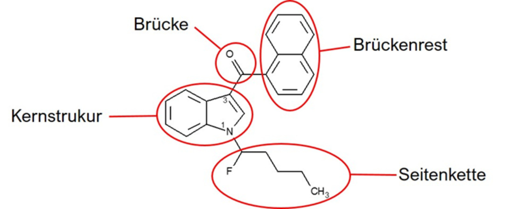

   1-Fluor-JWH-018 besitzt eine Indol-1,3-diyl-Kernstruktur, eine Carbonyl-Brücke in Position 3, einen 1-Naphthyl-Brückenrest und eine 1-Fluorpentyl-Seitenkette in Position 1.

    Kernstruktur, Brücke, Brückenrest und Seitenkette werden wie folgt definiert:

**2.1.1** **Kernstruktur**

    Die Kernstruktur schließt die nachfolgend in den Buchstaben a bis l beschriebenen Ringsysteme ein. Die Ringsysteme der Buchstaben a bis j können an den in den nachfolgenden Abbildungen gekennzeichneten Positionen mit einer beliebigen Kombination der Atome Wasserstoff, Fluor, Chlor, Brom, Iod und Phenyl‑, Methyl‑, Trifluormethyl-, Trimethylsilyl-, Methoxy‑, Trifluormethoxy- und Nitrogruppen als Atomgruppen (Reste R
    1                    bis R
    3                   ) substituiert sein.

    Die Wellenlinie gibt den Bindungsort für die Brücke an. Die durchbrochene Linie gibt den Bindungsort für die Seitenkette an:

    *        *   a)

        *   Indol-1,3-diyl (X = CH, C-CH
            3                             , C-F, C-Cl, C-Br und C-I) und Indazol-1,3-diyl (X = N)
            (Bindungsort für die Brücke in Position 3, Bindungsort für die Seitenkette in Position 1)

    *        *
        *            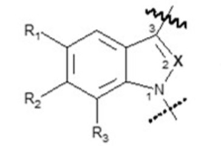
        *   X = CH, C-CH
            3                             , C-F, C-Cl, C-Br, C-I oder N

    *        *   b)

        *   4-, 5-, 6- oder 7-Azaindol-1,3-diyl (X = CH, C-CH
            3                             , C-F, C-Cl, C-Br und C-I) und 4-, 5-, 6- oder
            7-Azaindazol-1,3-diyl (X = N)
            (Bindungsort für die Brücke in Position 3, Bindungsort für die Seitenkette in Position 1)

    *        *
        *            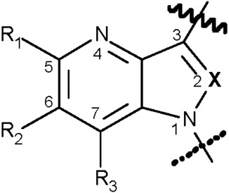
        *            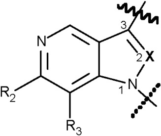
        *   jeweils:
            X = CH, C-CH
            3                             , C-F, C-Cl, C-Br, C-I oder N

    *        *
        *   4-Aza-Derivate

        *   5-Aza-Derivate

    *        *
        *            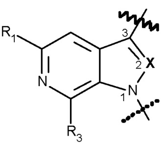
        *            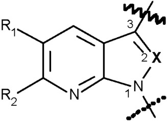

    *        *
        *   6-Aza-Derivate

        *   7-Aza-Derivate

    *        *   c)

        *   1
            H                             -Indol-2-on-1,3-diyl
            (Bindungsort für die Brücke in Position 3,
            Bindungsort für die Seitenkette in Position 1)

        *            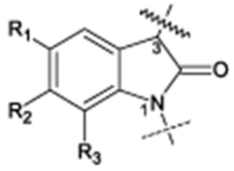

    *        *   d)

        *   Carbazol-1,4-diyl
            (Bindungsort für die Brücke in Position 4,
            Bindungsort für die Seitenkette in Position 1)

        *            

    *        *   e)

        *   Benzimidazol-1,2-diyl-Isomer I
            (Bindungsort für die Brücke in Position 2,
            Bindungsort für die Seitenkette in Position 1)

        *            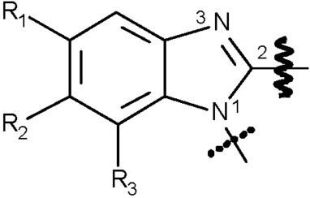

    *        *
        *   und

        *
        *

    *        *
        *   Benzimidazol-1,2-diyl-Isomer II
            (Bindungsort für die Brücke in Position 1,
            Bindungsort für die Seitenkette in Position 2)

        *            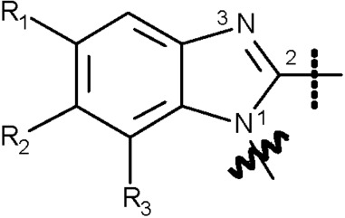

    *        *   f)

        *   Indolizin-1,3-diyl
            (Bindungsort für die Brücke in Position 1,
            Bindungsort für die Seitenkette in Position 3)

        *            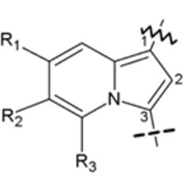

    *        *   g)

        *   6-, 7-, 8-Azaindolizin-1,3-diyl
            (Bindungsort für die Brücke in Position 1,
            Bindungsort für die Seitenkette in Position 3)

    *        *
        *            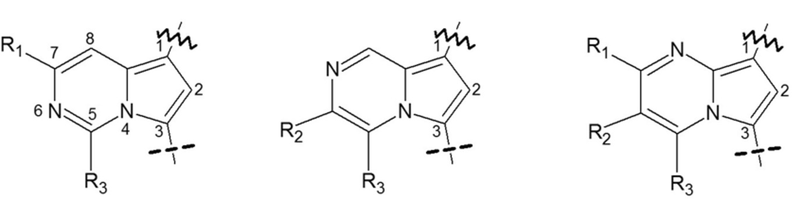

    *        *   h)

        *   2-Chinolon-1,3-diyl
            (Bindungsort für die Brücke in Position 3,
            Bindungsort für die Seitenkette in Position 1)

        *            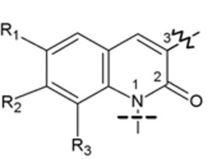

    *        *   i)

        *   5-,6-,7-,8-Aza-2-chinolon-1,3-diyl
            (Bindungsort für die Brücke in Position 3,
            Bindungsort für die Seitenkette in Position 1)

    *        *
        *            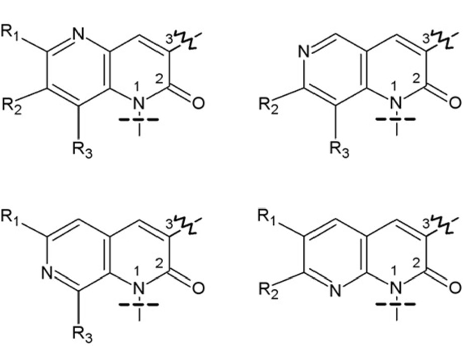

    *        *   j)

        *   3-Phenylpyrazol-1,5-diyl
            (Bindungsort für die Brücke in Position 5,
            Bindungsort für die Seitenkette in Position 1)

        *            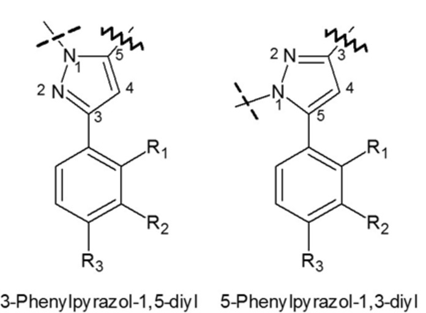

    *        *
        *   und

    *        *
        *   5-Phenylpyrazol-1,3-diyl
            (Bindungsort für die Brücke in Position 3,
            Bindungsort für die Seitenkette in Position 1)

    *        *   k)

        *   Zusätzlich zu den unter den Buchstaben a und b genannten Kernstrukturen werden auch folgende vom Pyrrol und Pyrazol abgeleitete Kernstrukturen erfasst:

    *        *
        *   Pyrrol-1,3-diyl (X = CH, C-CH
            3                             , C-F, C-Cl, C-Br und C-I) und Pyrazol-1,3-diyl (X = N) mit nichtaromatischer Ringanellierung in 4- und 5-Position
            (Bindungsort für die Brücke in Position 3,
            Bindungsort für die Seitenkette in Position 1)

    *        *
        *            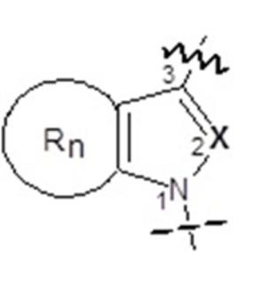
        *
        *   X = CH, C-CH
            3                             , C-F, C-Cl, C-Br, C-I oder N

    *        *
        *   Der anellierte Rest R
            n                              kann in dieser Untergruppe aus gesättigten oder ungesättigten, nicht jedoch aromatischen Mono- und Polyzyklen bestehen. Aromatisch anellierte Pyrrole und Pyrazole werden durch die unter den Buchstaben a und b genannten Kernstrukturen erfasst. Monozyklen können drei bis acht Ringatome (inklusive der beiden anellierten C-Atome an der Kernstruktur) aufweisen. Bei den Polyzyklen darf jeder Ring drei bis sieben Ringatome (inklusive der beiden anellierten C-Atome an der Kernstruktur) aufweisen. Die Ringatome von Mono- und Polyzyklen können aus den Atomen Kohlenstoff, Sauerstoff und Schwefel bestehen. Das anellierte Ringsystem R
            n                              kann an beliebigen Positionen mit einer beliebigen Kombination folgender Atome und Atomgruppen substituiert sein: Wasserstoff, Fluor, Chlor, Brom, Iod und Phenyl‑, Methyl‑, Trifluormethyl-, Trimethylsilyl-, Methoxy‑, Trifluormethoxy- und Nitrogruppen.

    *        *   l)

        *   4-Chinolon-1,3-diyl
            (Bindungsort für die Brücke in Position 3,
            Bindungsort für die Seitenkette in Position 1)

        *            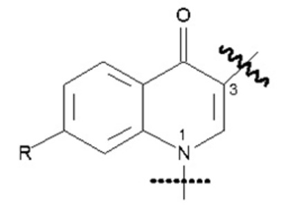

    *        *
        *   Der Rest R kann aus einem der folgenden Atome oder der folgenden Atomgruppe bestehen: Wasserstoff, Fluor, Chlor, Brom, Iod und Phenylthiogruppe (Anbindung über den Schwefel an die Kernstruktur).

**2.1.2** **Brücke an der Kernstruktur**

    Die Brücke an der Kernstruktur schließt die folgenden Strukturelemente ein, die jeweils an der unter Nummer 2.1.1 bezeichneten Stelle an die Kernstruktur gebunden sind:

    a)  Carbonyl‑, Methylencarbonyl‑ (CH
        2                         -Gruppe an Kernstruktur geknüpft) und Azacarbonylgruppe,

    b)  Carboxamidogruppe (Carbonylgruppe an Kernstruktur geknüpft) unter Einschluss von kohlenstoff- und wasserstoffhaltigen Substituenten am Amidstickstoff, die mit Position 2 der Indolkernstruktur (Nummer 2.1.1 Buchstabe a: X = CH) einen Sechsring bilden, und Methylencarboxamidogruppe (CH
        2                         -Gruppe an Kernstruktur geknüpft),

    c)  Carboxyl- (Carbonylgruppe an Kernstruktur geknüpft) und Methylencarboxylgruppe (CH
        2                         -Gruppe an Kernstruktur geknüpft),

    d)  direkt an die Kernstruktur angebundene Stickstoffheterocyclen, die auch weitere Stickstoff-, Sauerstoff- oder Schwefelatome enthalten können, mit einer Ringgröße von bis zu fünf Atomen sowie einer Doppelbindung zum Stickstoffatom an der Anknüpfungsstelle,

    e)  Hydrazongruppe mit Doppelbindung vom Stickstoff zu Position 3 der Kernstruktur zu Nummer 2.1.1 Buchstabe c,

    f)  Oxaspirocycloalkylgruppen mit einem Sauerstoffatom benachbart zum Spirozentrum, die eine Ringgröße des Oxaspirocycloalkylrings bis zu sechs Atome insgesamt nicht übersteigen (x = 1 – 4).

        *            *                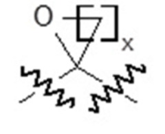

**2.1.3** **Brückenrest**

    a)  Der Brückenrest kann Kombinationen der Atome Kohlenstoff, Wasserstoff, Stickstoff, Sauerstoff, Silizium, Schwefel, Fluor, Chlor, Brom und Iod enthalten, die eine maximale Molekülmasse von 400 u haben und folgende Strukturelemente beinhalten können:

        aa) beliebig substituierte gesättigte, ungesättigte oder aromatische Ringstrukturen einschließlich Polyzyklen und Heterozyklen, wobei eine Anbindung an die Brücke auch über einen Substituenten möglich ist,

        bb) beliebig substituierte Kettenstrukturen mit mindestens einem Kohlenstoffatom, die unter Einbeziehung der Heteroatome eine durchgehende Kettenlänge von maximal zwölf Atomen (ohne Mitzählung von Wasserstoffatomen) aufweisen.

    b)  Brücken mit der Möglichkeit der Anbindung von mehreren Brückenresten, beispielsweise Brücken zu Nummer 2.1.2 Buchstabe b, d oder Buchstabe e, können auch mehrere Brückenreste gemäß den Definitionen zu Nummer 2.1.3 Buchstabe a Doppelbuchstabe aa und zu Nummer 2.1.3 Buchstabe a Doppelbuchstabe bb tragen. Die Molekülmassenbeschränkung von insgesamt 400 u gilt dann für die Summe der Brückenreste.

**2.1.4** **Seitenkette**

    Die Seitenkette kann beliebige Kombinationen der Atome Kohlenstoff, Wasserstoff, Stickstoff, Sauerstoff, Schwefel, Silizium, Fluor, Chlor, Brom und Iod aufweisen, soweit sie nicht gemäß den Buchstaben a und b eingeschränkt werden. Die Seitenkette darf eine maximale Molekülmasse von 300 u aufweisen und muss jeweils an der unter Nummer 2.1.1 bezeichneten Stelle der Kernstruktur angebunden sein. Die Seitenkette kann folgende Strukturelemente aufweisen:

    a)  beliebig substituierte Kettenstrukturen mit mindestens einem Kohlenstoffatom, die innerhalb der Kette neben weiteren Kohlenstoffatomen ausschließlich auch Sauerstoff‑, Schwefel- und Siliziumatome aufweisen können und unter Einbeziehung der Heteroatome eine durchgehende Kettenlänge von drei bis maximal zehn Atomen (ohne Mitzählung von Wasserstoffatomen) aufweisen,

    b)  direkt angebundene oder über eine Kohlenwasserstoffbrücke (gesättigt oder einfach ungesättigt, verzweigt oder nicht verzweigt, in Position 2 optional oxo-substituiert) mit insgesamt ein bis vier Kohlenstoffatomen gekoppelte, beliebig substituierte gesättigte, ungesättigte oder aromatische Ringstrukturen mit drei bis sieben Ringatomen einschließlich Polyzyklen und Heterozyklen. Bei den Polyzyklen darf jeder Ring drei bis sieben Ringatome aufweisen. Heterozyklen dürfen neben Kohlenstoff die Atome Sauerstoff, Stickstoff und Schwefel im Ring aufweisen. Eine mögliche freie Valenz eines Stickstoffatoms im Ring kann ein Wasserstoffatom oder einen Methyl- oder Ethylrest tragen.

**2.2** **Von 3-Sulfonylamidobenzoesäure abgeleitete Verbindungen**

    Zu dieser eigenständigen Gruppe der Cannabimimetika/synthetischen Cannabinoide, die nicht nach dem unter Nummer 2.1 beschriebenen modularen Aufbau zusammengesetzt ist, gehören die Stoffe, die eine der beiden unter Nummer 2.2.1 beschriebenen Kernstrukturen besitzen, mit den unter Nummer 2.2.2 beschriebenen Substituenten besetzt sein können und eine maximale Molekülmasse von 500 u haben.

**2.2.1** **Kernstruktur**

    Die Kernstruktur schließt die nachfolgend in den Buchstaben a und b beschriebenen Moleküle ein. Diese können an den in den nachfolgenden Abbildungen gekennzeichneten Positionen mit den unter Nummer 2.2.2 genannten Atomen und Atomgruppen (Reste R
    1                    bis R
    4                   ) substituiert sein:

    *        *   a)

        *   3-Sulfonylamidobenzoate

        *            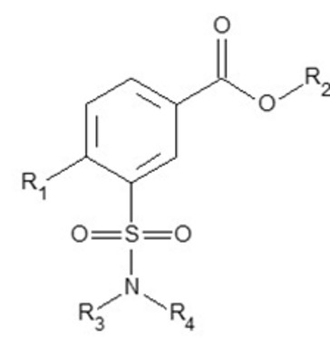

    *        *   b)

        *   3-Sulfonylamidobenzamide

        *            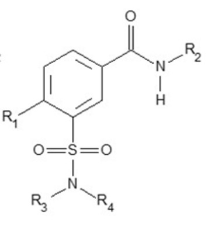

**2.2.2** Reste R
    1 **** **, R**
    2 **** **, R**
    3 **** **und R**
    4 ****

    a)  Der Rest R
        1                          kann aus einem der folgenden Atome oder einer der folgenden Atomgruppen bestehen: Wasserstoff, Fluor, Chlor, Brom, Iod, Methyl-, Ethyl- und Methoxygruppe.

    b)  Der Rest R
        2                          kann aus einem der folgenden Ringsysteme bestehen: Phenyl-, Pyridyl-, Cumyl-,
        8-Chinolinyl-,                          3-Isochinolinyl-, 1-Naphthyl- und Adamantylrest. Diese Ringsysteme können weiterhin mit beliebigen Kombinationen der folgenden Atome oder Atomgruppen substituiert sein: Wasserstoff, Fluor, Chlor, Brom, Iod, Methoxy-, Amino-, Hydroxy-, Cyano-, Methyl- und Phenoxygruppen.

    c)  Die Reste R
        3                          und R
        4                          können aus Wasserstoffatomen, Methyl-, Ethyl-, Propyl- und Isopropylgruppen in beliebiger Kombination bestehen. Die Reste R
        3                          und R
        4                          können auch ein gesättigtes Ringsystem bis zu einer Größe von sieben Atomen einschließlich des Stickstoffatoms bilden. Dieses Ringsystem kann die weiteren Elemente Stickstoff, Sauerstoff und Schwefel enthalten und eine beliebige Kombination der Elemente Wasserstoff, Fluor, Chlor, Brom und Iod tragen. Für die Substitution des Stickstoffatoms in einem solchen Ring gelten die für die Reste R
        3                          und R
        4                          in Satz 1 von Buchstabe c angegebenen Substitutionsmöglichkeiten.

**2.3** Von 6
    H                     -Benzo(c)chromen-1-ol (6
    H **-Dibenzo(b,d)pyran-1-ol) abgeleitete Verbindungen**

    Zu dieser eigenständigen Gruppe der Cannabimimetika/synthetischen Cannabinoide, die nicht nach dem unter den Nummern 2.1 und 2.2 beschriebenen modularen Aufbau zusammengesetzt sind, gehören die Stoffe, die eine unter Nummer 2.3.1 beschriebene Kernstruktur besitzen, mit den unter Nummer 2.3.2 beschriebenen Substituenten besetzt sein können und eine maximale Molekülmasse von 600 u haben.

**2.3.1** **Kernstruktur**

    Die Kernstruktur schließt folgende von 6
    H                   -Benzo(c)chromen-1-ol (6
    H                   -Dibenzo(b,d)pyran-1-ol) abgeleiteten Verbindungen ein unabhängig vom Hydrierungsgrad des aromatischen Ringes A und der Position der dabei gegebenenfalls darin verbleibenden Doppelbindungen. Die Verbindungen können an den gekennzeichneten Positionen mit den unter Nummer 2.3.2 genannten Atomen und Atomgruppen (Reste R
    1                    bis R
    5                    und R
    n                   ) substituiert sein:

    *        *            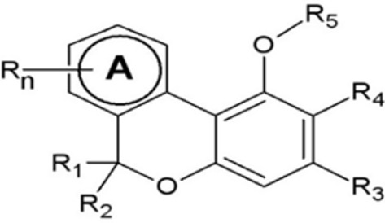

**2.3.2** **Reste R**
    1 **** **, R**
    2 **** **, R**
    3 **** **, R**
    4 **** **, R**
    5 **** **und R**
    n ****

    a)  Der Ring A kann an jeder Position mit beliebigen Kombinationen folgender Atome und Atomgruppen (R
        n                         ) substituiert sein: Wasserstoff, Brom, Chlor, Fluor, Iod, Hydroxy-, Alkylcarbonyloxy- (Alkylrest bis C
        5                         ), Alkoxycarbonyloxy- (Alkylrest bis C
        5                         ), Alkoxy- (Alkylrest bis C
        5                         ), Hydroxymethyl-, Methyl- und Trialkylsilylgruppen (maximal zwölf C-Atome in den Trialkylresten insgesamt) sowie Kohlenstoffketten (gesättigt oder ungesättigt, verzweigt oder nicht verzweigt, bis C
        10                         ). Die vorgenannten Atomgruppen, außer den Trialkylsilylgruppen, können mit folgenden Atomen und Atomgruppen substituiert sein: Wasserstoff, Fluor, Chlor, Brom, Iod und Trialkylsilylgruppen (maximal zwölf C-Atome in den Trialkylresten insgesamt).

    b)  Die Reste R
        1                          und R
        2                          können aus Wasserstoff oder den folgenden Atomgruppen bestehen: Alkyl- (bis C
        5                         ) und Trialkylsilylgruppen (maximal zwölf C-Atome in den Trialkylresten insgesamt). Die vorgenannten Atomgruppen außer der Trialkylsilylgruppe können mit folgenden Atomen und Atomgruppen substituiert sein: Wasserstoff, Fluor, Chlor, Brom, Iod und Trialkylsilylgruppen (maximal zwölf C-Atome in den Trialkylresten insgesamt).

    c)  Der Rest R
        3                          kann aus Wasserstoff oder einer der folgenden Atomgruppen bestehen: Methylgruppe sowie Kohlenstoffkette (gesättigt oder ungesättigt, verzweigt oder nicht verzweigt, bis C
        12                         ) und Trialkylsilylgruppe (maximal zwölf C-Atome in den Trialkylresten insgesamt). Die vorgenannten Atomgruppen außer der Trialkylsilylgruppe können mit folgenden Atomen und Atomgruppen substituiert sein: Wasserstoff, Fluor, Chlor, Brom, Iod und Trialkylsilylgruppen (maximal zwölf C-Atome in den Trialkylresten insgesamt).

    d)  Der Rest R
        4                          kann aus Wasserstoff oder aus einer der folgenden Atomgruppen bestehen: Alkyl- (bis C
        5                         ), Alkenyl- (bis C
        5                         ), Carboxyl- oder Alkyloxycarbonylgruppe (Alkylrest bis C
        5                         ).

    e)  Der Rest R
        5                          kann aus Wasserstoff oder einer der folgenden Atomgruppen bestehen: Alkyl- (bis C
        7                         ), Trialkylsilyl- (maximal zwölf C-Atome in den Trialkylresten insgesamt), Alkyloxycarbonyl- (Alkylrest bis C
        7                         ), Alkylcarbonyl- (Alkylrest bis C
        7                         ), Cycloalkylcarbonyl- und Cycloalkylmethylcarbonyl- (jeweils mit drei bis sieben Ringatomen einschließlich Polyzyklen), Arylcarbonyl- (mit drei bis sechs Ringatomen einschließlich Polyzyklen und Heterozyklen) und Arylmethylcarbonylgruppe (mit drei bis sechs Ringatomen einschließlich Polyzyklen und Heterozyklen). Bei den Polyzyklen darf jeder Ring jeweils drei bis sieben Ringatome aufweisen. Die vorgenannten Atomgruppen außer der Trialkylsilylgruppe können mit folgenden Atomen und Atomgruppen substituiert sein: Wasserstoff, Fluor, Chlor, Brom, Iod und Trialkylsilylgruppen (maximal zwölf C-Atome in den Trialkylresten insgesamt). Heterozyklen dürfen neben Kohlenstoff die Atome Sauerstoff, Stickstoff und Schwefel im Ring aufweisen. Eine mögliche freie Valenz eines Stickstoffatoms im Ring kann ein Wasserstoffatom oder einen Methyl- oder Ethylrest tragen.

**3.** Benzodiazepine ****

    Die Gruppe der Benzodiazepine umfasst 1,4- und 1,5-Benzodiazepine und ihre Triazolo- und Imidazolo-Derivate (Nummer 3.1.1 Buchstabe a und b), einige speziell substituierte Untergruppen dieser Benzodiazepine (Nummer 3.1.1 Buchstabe c bis g) sowie einige offenkettige Benzodiazepin-Prodrugs (Nummer 3.2.1). Die maximale Molekülmasse beträgt jeweils 600 u.

**3.1** **Zyklische Vertreter**

**3.1.1** **Kernstruktur**

    Die Kernstruktur schließt die nachfolgend in den Buchstaben a bis g beschriebenen Ringsysteme ein. Diese Ringsysteme können an den in den nachfolgenden Abbildungen gekennzeichneten Positionen mit den unter Nummer 3.1.2 genannten Atomen oder Atomgruppen (Reste R
    1                    bis R
    8                    und X) substituiert sein:

    a)  1,4-Benzodiazepine

        *            *                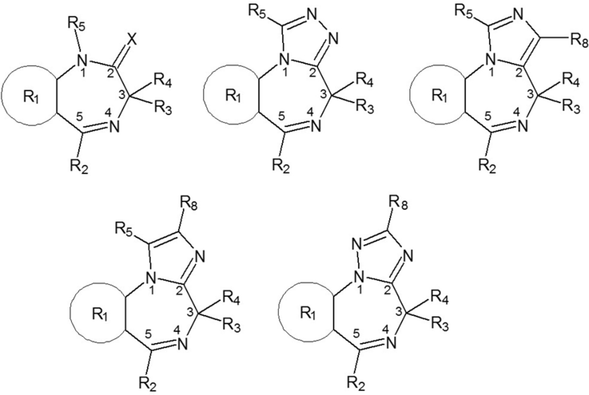

    b)  1,5-Benzodiazepine

        *            *                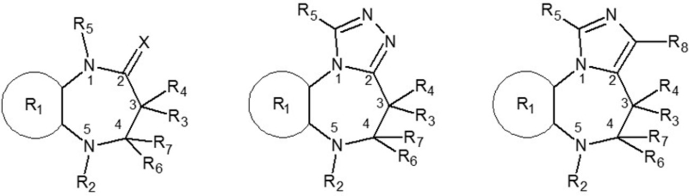

    c)  Loprazolam-Abkömmlinge

        *            *                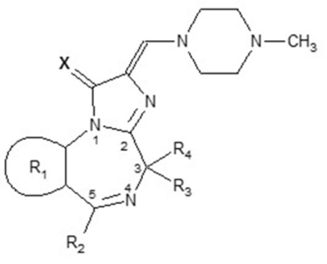

    d)  Ketazolam-Abkömmlinge

        *            *                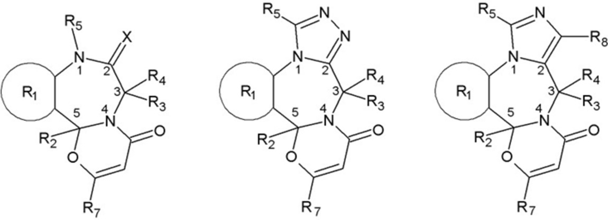

    e)  Oxazolam-Abkömmlinge

        *            *                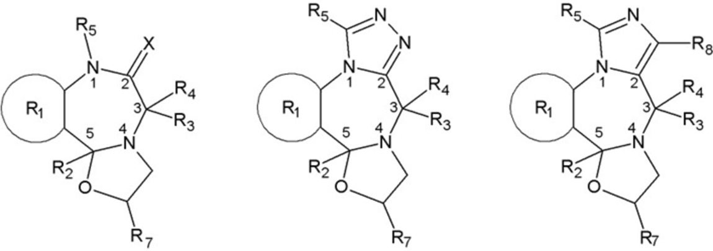

    f)  Chlordiazepoxid-Abkömmlinge

        *            *                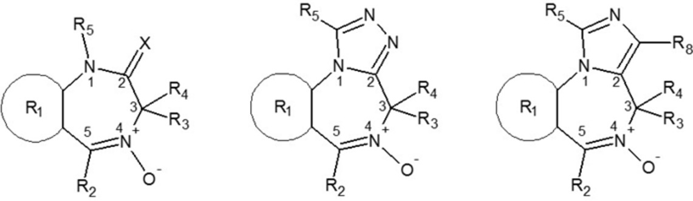

    g)  Bretazenil-Abkömmlinge

        *            *                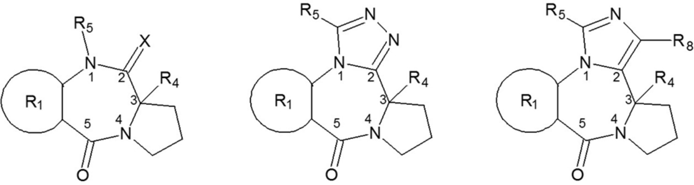

**3.1.2** **Reste R**
    1 **** **bis R**
    8 **** **und X**

    a)  Der Rest R
        1                          schließt eines der folgenden an die Siebenringe der Kernstrukturen anellierten Ringsysteme ein:

        Phenyl-, Thienyl-, 4,5,6,7-Tetrahydrobenzo[b]thienyl-, Furanyl- und Pyridylring; die Heteroatome im Thienyl-, Furanyl- und Pyridylring können an jeder beliebigen Position außerhalb des Siebenringes der Kernstruktur stehen.

        Der Rest R
        1                          kann weiterhin mit einem oder mehreren der folgenden Atome oder Atomgruppen in beliebiger Kombination und an beliebigen Positionen außerhalb des Siebenringes substituiert sein: Wasserstoff, Fluor, Chlor, Brom, Iod, Methyl-, Ethyl-, Nitro- und Aminogruppen.

    b)  Der Rest R
        2                          schließt eines der folgenden Ringsysteme ein:

        Phenyl-, Pyridyl- (mit Stickstoffatom an beliebiger Position im Pyridylring) und Cyclohexenylring (mit Doppelbindung an beliebiger Position im Cyclohexenylring).

        Phenyl- und Pyridylring können einen oder mehrere der folgenden Substituenten in beliebiger Kombination und an beliebiger Position tragen: Wasserstoff, Fluor, Chlor, Brom, Iod, Methyl-, Ethyl-, Nitro- und Aminogruppen.

    c)  Der Rest R
        3                          kann aus Wasserstoff oder einer der folgenden Atomgruppen bestehen:

        Hydroxy-, Carboxyl-, Ethoxycarbonyl-, (N,N-Dimethyl)carbamoyl-, Succinyloxy-, Alkoxycarbonylalkyl- (Alkoxygruppe bis C
        4                         , Alkylgruppe bis C
        4                         ) und Methylgruppe.

    d)  Der Rest R
        4                          kann aus Wasserstoff oder einer der folgenden Atomgruppen bestehen:

        Methyl- und Ethylgruppe.

    e)  Die Reste R
        3                          und R
        4                          können auch gemeinsam eine Carbonylgruppe (C=O) bilden.

    f)  Der Rest R
        5                          kann aus Wasserstoff oder einer der folgenden Atomgruppen bestehen:

        Methyl-, Ethyl-, (N,N-Dimethylamino)methyl-, (N,N-Diethylamino)methyl-, (N,N-Dimethylamino)ethyl-,
        (N,N-Diethylamino)ethyl-,                          (Cyclopropyl)methyl-, (Trifluormethyl)methyl-, Hydrazidomethyl- und Prop-2-in-1-ylgruppe.

    g)  Der Rest R
        6                          kann aus Wasserstoff oder einer der folgenden Atomgruppen bestehen:

        Hydroxy- und Methylgruppe.

    h)  Der Rest R
        7                          kann aus Wasserstoff oder einer der folgenden Atomgruppen bestehen:

        Methyl- und Ethylgruppe.

    i)  Die Reste R
        6                          und R
        7                          können bei den 1,5-Benzodiazepinen auch gemeinsam eine Carbonylgruppe (C=O) bilden.

    j)  Bei den 1,5-Benzodiazepinen kann statt R
        2                          und R
        7                          auch eine mit R
        6                          substituierte Doppelbindung zum 5-Stickstoff-Atom vorliegen.

    k)  Der Rest R
        8                          kann aus Wasserstoff oder einer Alkyloxycarbonyl- (Alkylrest bis C
        6                         ) oder einer N,N-Dimethylcarbamoylgruppe bestehen.

    l)  Der Rest X schließt eines der folgenden Atome oder eine der folgenden Atomgruppen ein:

        Sauerstoff, Schwefel, Imino- und N-Methyliminogruppe. Wenn R
        3                         , R
        4                          oder R
        5                          aus Wasserstoff besteht, können als tautomere Formen auch die entsprechenden Enole, Thioenole oder Enamine vorliegen.

**3.2** **Offenkettige Benzodiazepin-Prodrugs**

    Zu dieser eigenständigen Gruppe der Benzodiazepin-Analoga, die nicht nach dem unter Nummer 3.1.1 beschriebenen modularen Aufbau zusammengesetzt sind, gehören die Stoffe, die eine unter Nummer 3.2.1 beschriebene Kernstruktur besitzen und mit den unter Nummer 3.2.2 beschriebenen Substituenten (Reste R
    1                    bis R
    7                    und X) besetzt sein können.

**3.2.1** **Kernstruktur**

    *        *            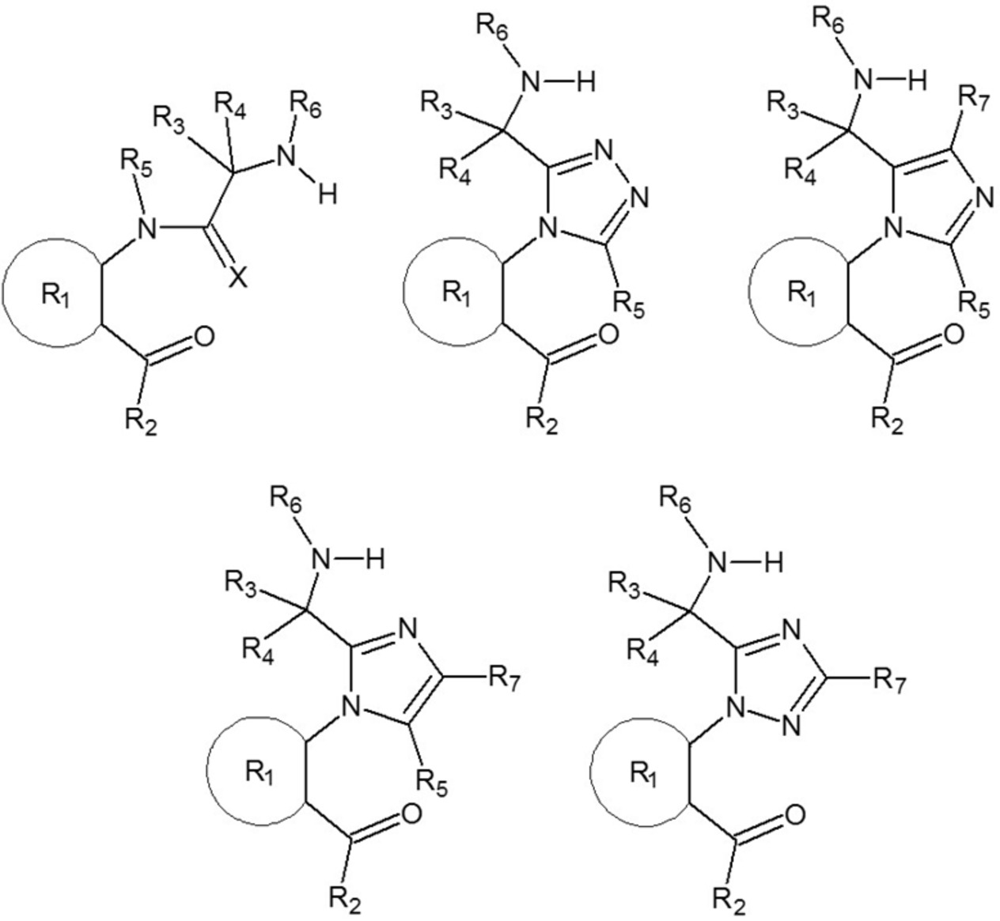

**3.2.2** **Reste R**
    1 **** **bis R**
    7 **** **und X**

    a)  Der Rest R
        1                          schließt eines der folgenden Ringsysteme ein:

        Phenyl-, Thienyl-, 4,5,6,7-Tetrahydrobenzo[b]thienyl-, Furanyl- und Pyridylring; die Heteroatome im Thienyl-, Furanyl- und Pyridylring können an jeder beliebigen Position des Restes R
        1                          stehen. Die von R
        1                          ausgehenden Bindungen müssen an benachbarten Positionen der vorgenannten Ringssysteme stehen.

        Der Rest R
        1                          kann weiterhin mit einem oder mehreren der folgenden Atome oder Atomgruppen in beliebiger Kombination und an beliebigen Positionen substituiert sein: Wasserstoff, Fluor, Chlor, Brom, Iod, Methyl-, Ethyl-, Nitro- und Aminogruppen.

    b)  Der Rest R
        2                          schließt eines der folgenden Ringsysteme ein:

        Phenyl-, Pyridyl- (mit Stickstoffatom an beliebiger Position im Pyridylring) und Cyclohexenylring (mit Doppelbindung an beliebiger Position im Cyclohexenylring).

        Phenyl- und Pyridylring können einen oder mehrere der folgenden Substituenten in beliebiger Kombination und an beliebiger Position tragen: Wasserstoff, Fluor, Chlor, Brom, Iod, Methyl-, Ethyl-, Nitro- und Aminogruppen.

    c)  Der Rest R
        3                          kann aus Wasserstoff oder einer der folgenden Atomgruppen bestehen:

        Hydroxy-, Carboxyl-, Ethoxycarbonyl-, (N,N-Dimethyl)carbamoyl-, Succinyloxy-, Alkoxycarbonylalkyl- (Alkoxygruppe bis C
        4                         , Alkylgruppe bis C
        4                         ) und Methylgruppe.

    d)  Der Rest R
        4                          kann aus Wasserstoff oder einer der folgenden Atomgruppen bestehen:

        Methyl- und Ethylgruppe.

    e)  Die Reste R
        3                          und R
        4                          können auch gemeinsam eine Carbonylgruppe (C=O) bilden.

    f)  Der Rest R
        5                          kann aus Wasserstoff oder einer der folgenden Atomgruppen bestehen:

        Methyl-, Ethyl-, (N,N-Dimethylamino)methyl-, (N,N-Diethylamino)methyl-, (N,N-Dimethylamino)ethyl-,
        (N,N-Diethylamino)ethyl-,                          (Cyclopropyl)methyl-, (Trifluormethyl)methyl-, Hydrazidomethyl- und Prop-2-in-1-ylgruppe.

    g)  Der Rest R
        6                          kann aus Wasserstoff oder aus einer Alkylcarbamoyl-Gruppe (Alkylrest bis C
        6                         ) bestehen. Weiterhin kann R
        6                          aus einem der folgenden Aminosäure-Reste (Bindung über den C-Terminus) bestehen: Glycin, Alanin und Lysin.

    h)  Der Rest R
        7                          kann aus Wasserstoff oder einer Alkyloxycarbonyl- (Alkyrest bis C
        6                         ) oder einer N,N-Dimethylcarbamoylgruppe bestehen.

    i)  Der Rest X schließt eines der folgenden Atome oder eine der folgenden Atomgruppen ein:

        Sauerstoff, Schwefel, Imino- und N-Methyliminogruppe. Wenn R
        3                         , R
        4                          oder R
        5                          aus Wasserstoff besteht, können als tautomere Formen auch die entsprechenden Enole, Thioenole oder Enamine vorliegen.

**4.** Von N-(2-Aminocyclohexyl)amid abgeleitete Verbindungen ****

    Eine von N-(2-Aminocyclohexyl)amid abgeleitete Verbindung ist jede chemische Verbindung, die von der nachfolgend abgebildeten Grundstruktur abgeleitet werden kann, eine maximale Molekülmasse von 500 u hat und mit den nachfolgend beschriebenen Substituenten besetzt sein kann.

    *        *            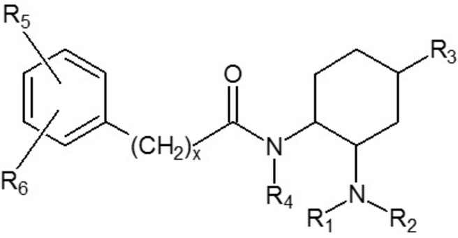

   Die Anzahl x der Methylengruppen (-CH
    2                   )
    x                    zwischen dem Phenylring und der Carbonylgruppe in der Kernstruktur kann null oder eins betragen.

    Die Grundstruktur N-(2-Aminocyclohexyl)amid kann an den in der Abbildung gekennzeichneten Positionen mit einer beliebigen Kombination der folgenden Atome, verzweigten oder nicht verzweigten Atomgruppen oder Ringsystemen (Reste R
    1                    bis R
    6                   ) substituiert sein:

    a)  R
        1                          und R
        2                         :

        Wasserstoff und Alkylgruppen (bis C
        7                         ).

        Ferner sind Stoffe eingeschlossen, bei denen das Stickstoffatom Bestandteil eines zyklischen Systems ist (z. B. Pyrrolidinyl-).

        Der Rest R
        1                          oder R
        2                          kann auch an die Bindungsstelle der NR
        1                         R
        2                         -Gruppe am Sechsring anknüpfen (unter Bildung einer sogenannten Spiroverbindung). Diese stickstoffhaltigen Ringe dürfen eine Ringgröße von drei bis sieben Atomen aufweisen (ein Stickstoffatom und zwei bis sechs Kohlenstoffatome).

    b)  R
        3                         :

        Wasserstoff und Oxaspirogruppe (Ringgröße von drei bis acht Atomen einschließlich des Sauerstoffatoms).

    c)  R
        4                         :

        Wasserstoff und Alkylgruppe (bis C
        5                         ).

    d)  R
        5                          und R
        6                         :

        Der Phenylring kann an den Positionen 2, 3, 4, 5 und 6 beliebige Kombinationen folgender Substituenten enthalten: Wasserstoff, Brom, Chlor, Fluor, Iod und Trifluormethylgruppen.

        Ferner sind Stoffe eingeschlossen, bei denen R
        5                          und R
        6                          gemeinsam an benachbarten C-Atomen ein Ringsystem (bis C
        6                         ) unter Einbeziehung von Heteroatomen (Sauerstoff, Schwefel, Stickstoff) bilden. Im Fall eines Stickstoffs in diesem Ringsystem darf dieser die Substituenten Wasserstoff und Methylgruppe tragen.

**5.** Von Tryptamin abgeleitete Verbindungen ****

**5.1** **Indol-3-alkylamine**

    Eine von Indol-3-alkylamin abgeleitete Verbindung ist jede chemische Verbindung, die von der nachfolgend abgebildeten Grundstruktur abgeleitet werden kann, eine maximale Molekülmasse von 500 u hat und mit den nachfolgend beschriebenen Substituenten besetzt sein kann. Ausgenommen hiervon sind Tryptamin, die natürlich vorkommenden Neurotransmitter Serotonin und Melatonin sowie deren aktive Metaboliten (z. B.: 6-Hydroxymelatonin).

    *        *            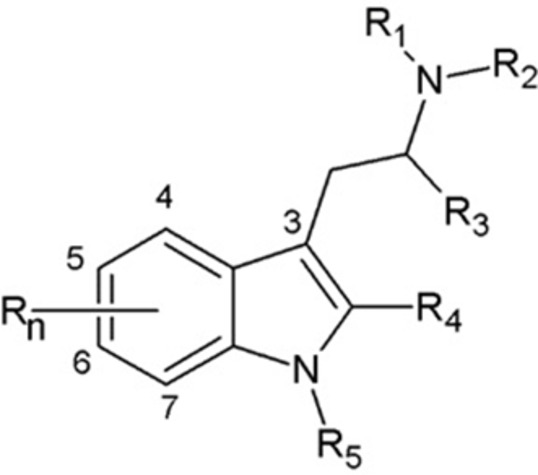

   Die Grundstruktur Indol-3-alkylamin kann an den in der Abbildung gekennzeichneten Positionen mit den folgenden Atomen, verzweigten oder nicht verzweigten Atomgruppen oder Ringsystemen (Reste R
    1                    bis R
    5                    und R
    n                   ) substituiert sein:

    a)  R
        1                          und R
        2                         :

        Wasserstoff, Alkyl- (bis C
        6                         ), Cycloalkyl- (Ringgröße bis C
        6                         ), Cycloalkylmethyl- (Ringgröße bis C
        6                         ), Allyl-, Alkyloxycarbonyl- (Alkylrest bis C
        6                         ), Alkylthiocarbonyl- (Alkylrest bis C
        6                         ) und Alkylcarbamoylgruppen (Alkylrest bis C
        6                         ).

        Ferner sind Stoffe eingeschlossen, bei denen das Stickstoffatom Bestandteil eines Pyrrolidinyl-, Piperidinyl- oder Morpholinyl-Ringsystems ist.

    b)  R
        3                         :

        Wasserstoff und Alkylgruppe (bis C
        3                         ).

    c)  R
        4                         :

        Wasserstoff und Alkylgruppe (bis C
        2                         ).

    d)  R
        5                         :

        Wasserstoff, Alkyl- (bis C
        3                         ), Alkylcarbonyl- (bis C
        10                         ), Cycloalkylcarbonyl- (Ringgröße C
        3                          bis C
        6                         ), Cycloalkylmethylcarbonyl- (Ringgröße C
        3                          bis C
        6                         ), Cycloalkylethylcarbonyl- (Ringgröße C
        3                          bis C
        6                         ), Cycloalkylpropylcarbonyl- (Ringgröße C
        3                          bis C
        6                         ), Alkyloxycarbonyl- (Alkylrest bis C
        6                         ), Alkylthiocarbonyl- (Alkylrest bis C
        6                         ), Alkylcarbamoyl- (Alkylrest bis C
        6                         ), Benzylcarbonyl- und (Trialkylsilyl)alkylcarbonylgruppe (Alkylreste bis C
        6                         , maximal zwölf C-Atome in den Trialkylresten insgesamt).

    e)  R
        n                         :

        Das Indolringsystem kann an den Positionen 4, 5, 6 und 7 mit folgenden Atomen oder Atomgruppen substituiert sein: Wasserstoff, Fluor, Chlor, Brom, Iod, Alkyl- (bis C
        4                         ), Alkyloxy- (bis C
        10                         ), Benzyloxy-, Carboxamido-, Methoxy-, Trialkylsilyl- (maximal zwölf C-Atome in den Trialkylresten insgesamt), Trifluormethyl-, Trifluormethoxy-, Acetoxy-, Hydroxy- und Methylthiogruppen, an Position 4 darüber hinaus mit Dihydrogenphosphat.

        Ferner sind Stoffe eingeschlossen, bei denen durch R
        n                          zwei benachbarte Kohlenstoffatome der Positionen 4, 5, 6 und 7 mit einer Methylendioxygruppe überbrückt werden.

**5.2** Δ
    9,10 **-Ergolene**

    Eine von Δ
    9,10                   -Ergolen abgeleitete Verbindung ist jede chemische Verbindung, die von der nachfolgend abgebildeten Grundstruktur abgeleitet werden kann, eine maximale Molekülmasse von 600 u hat und mit den nachfolgend beschriebenen Substituenten besetzt sein kann.

    *        *            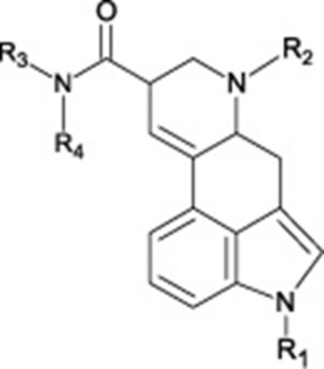

   Die Grundstruktur Δ
    9,10                   -Ergolen kann an den in der Abbildung gekennzeichneten Positionen mit den folgenden Atomen, verzweigten oder nicht verzweigten Atomgruppen oder Ringsystemen (Reste R
    1                    bis R
    4                   ) substituiert sein:

    a)  R
        1                         :

        Der Rest R
        1                          kann aus beliebigen Kombinationen der Atome Kohlenstoff, Wasserstoff, Stickstoff, Silizium, Sauerstoff, Schwefel, Fluor, Chlor, Brom und Iod bestehen, soweit sie nicht gemäß den Doppelbuchstaben aa und bb eingeschränkt werden. Der Rest R
        1                          darf eine maximale Molekülmasse von 300 u und folgende Strukturelemente aufweisen:

        aa) Wasserstoff oder beliebig substituierte Kettenstrukturen mit mindestens einem Kohlenstoffatom, die innerhalb der Kette neben weiteren Kohlenstoffatomen ausschließlich auch Silizium-, Sauerstoff- und Schwefelatome aufweisen können,

        bb) direkt angebundene oder über eine Kohlenwasserstoffbrücke (gesättigt oder einfach ungesättigt, verzweigt oder nicht verzweigt mit insgesamt ein bis fünf Kohlenstoffatomen) oder eine Carbonylgruppe oder eine Alkylcarbonylgruppe (Alkylrest bis C
            4                               , Bindung der Carbonylgruppe an den Stickstoff des Ergolens) oder eine Alkyloxycarbonylgruppe (Alkylrest bis C
            4                               , Bindung der Carbonylgruppe an den Stickstoff des Ergolens) oder eine Sulfonylgruppe gekoppelte, beliebig substituierte gesättigte, ungesättigte oder aromatische Ringstrukturen mit drei bis sieben Ringatomen einschließlich Polyzyklen und Heterozyklen. Bei den Polyzyklen darf jeder Ring drei bis sieben Ringatome aufweisen. Heterozyklen dürfen neben Kohlenstoff die Atome Sauerstoff, Stickstoff und Schwefel im Ring aufweisen. Eine mögliche freie Valenz eines Stickstoffatoms im Ring kann ein Wasserstoffatom oder einen Methyl- oder Ethylrest tragen.

    b)  R
        2                         :

        Wasserstoff, Alkyl- (bis C
        4                         ), Allyl- und Prop-2-in-1-yl-Gruppe.

    c)  R
        3                          und R
        4                         :

        Wasserstoff, Alkyl- (bis C
        5                         ), Cyclopropyl-, 1-Hydroxyalkyl- (bis C
        2                         ) und Allylgruppen.

        Ferner sind Stoffe eingeschlossen, bei denen das Amid-Stickstoffatom Bestandteil eines Morpholino-, Pyrrolidino- oder Dimethylazetidid-Ringsystems ist.

**6.** Von Arylcyclohexyl(methyl)amin abgeleitete Verbindungen ****

    Eine von Arylcyclohexyl(methyl)amin abgeleitete Verbindung ist jede chemische Verbindung, die von einer der nachfolgend abgebildeten Grundstrukturen abgeleitet werden kann, eine maximale Molekülmasse von 500 u hat und mit den nachfolgend beschriebenen Substituenten besetzt sein kann.

    *        *            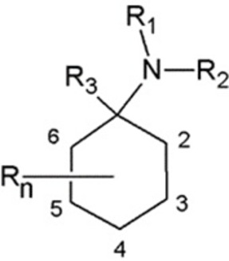
        *            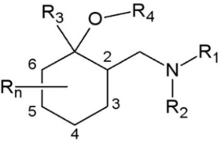

   Die Grundstrukturen können an den in den Abbildungen gekennzeichneten Positionen mit den folgenden Atomen, verzweigten oder nicht verzweigten Atomgruppen oder Ringsystemen (Reste R
    1                    bis R
    4                    und R
    n                   ) substituiert sein:

    a)  R
        1                         /R
        2                         :

        Wasserstoff, Alkyl- (bis C
        6                         ), Cycloalkyl- (Ringgröße bis C
        6                         ), Alkenyl- (bis C
        6                         ) und Alkinylgruppen (bis C
        6                         ).

        Die aufgeführten Atomgruppen können weiterhin mit beliebigen chemisch möglichen Kombinationen der Elemente Kohlenstoff, Wasserstoff, Stickstoff und Sauerstoff substituiert sein. Die auf diese Weise entstehenden Substituenten R
        1                         /R
        2                          dürfen dabei eine durchgehende Kettenlänge von maximal neun Atomen (ohne Mitzählung von Wasserstoffatomen) aufweisen. Atome von Ringstrukturen werden dabei nicht in die Zählung einbezogen.

        Zudem gehören Stoffe dazu, bei denen das Stickstoffatom Bestandteil eines zyklischen Systems ist (beispielsweise Pyrrolyl-, Pyrrolidinyl-, Piperidinyl-, Morpholino-Reste). Diese Ringsysteme dürfen im Ring die Elemente Kohlenstoff, Sauerstoff, Schwefel und Stickstoff aufweisen und eine Ringgröße bis zu sieben Atomen aufweisen. Die Ringsysteme können an jeder Position mit folgenden Atomen oder Atomgruppen substituiert sein: Wasserstoff, Fluor, Chlor, Brom, Iod, Hydroxy-, Alkyl- (bis C
        6                         ) und Phenylgruppen.

    b)  R
        3                         :

        Alkyl- (bis C
        6                         ), Alkinylgruppe (bis C
        6                         ) oder eines der folgenden Ringsysteme: Phenyl-, Pyrrolyl-,Pyridyl-, Thienyl-, Furanyl-, Methylendioxyphenyl-, Ethylendioxyphenyl-, Dihydrobenzofuranyl- und Benzothiophenyl-Ringsysteme.

        Die Ringsysteme können an jeder chemisch möglichen Position als R
        3                          an die Kernstruktur angebunden sein und an beliebiger Position mit folgenden Atomen oder Atomgruppen substituiert sein: Wasserstoff, Fluor, Chlor, Brom, Iod, Hydroxy-, Thiol-, Alkyl- (bis C
        6                         ), Alkoxy- (bis C
        6                         ), Alkylsulfanyl- (bis C
        6                         ) und Aminogruppen, einschließlich der chemischen Verbindungen, bei denen Substitutionen oder eine direkte Anbindung zu einem Ringschluss mit dem Cyclohexylring führen. Diese Ringsysteme dürfen eine Ringgröße von vier bis sechs Atomen aufweisen.

    c)  R
        4                         :

        Wasserstoff, Methyl-, Ethyl-, Alkylcarbonyl- (bis C
        4                         ), Alkoxycarbonyl- (Alkylrest bis C
        4                         ) und Trialkylsilylgruppe (maximal zwölf C-Atome in den Trialkylresten insgesamt).

    d)  R
        n                         :

        Das Cyclohexylringsystem kann an den Positionen zwei bis sechs mit folgenden Atomen oder Atomgruppen substituiert sein: Wasserstoff, Alkyl- (bis C
        6                         ), Alkoxy- (bis C
        6                         ), Hydroxy-, Phenylalkylgruppen (in der Alkylkette C
        1                          bis C
        4                         ) und Oxo-Gruppen (=O, doppelt gebundenes Sauerstoffatom am Ring).

**7.** Von Benzimidazol abgeleitete Verbindungen ****

    Eine von Benzimidazol abgeleitete Verbindung ist jede chemische Verbindung, die von der nachfolgend abgebildeten Grundstruktur abgeleitet werden kann, eine maximale Molekülmasse von 600 u hat und mit den nachfolgend beschriebenen Substituenten besetzt sein kann:

    *        *            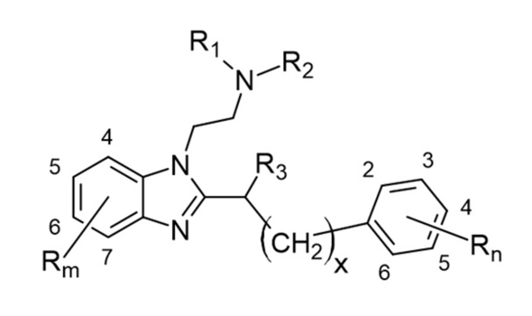

   Die Anzahl x der Methylengruppen (CH
    2                   )
    x                    kann null oder eins betragen.

    Die Grundstruktur kann an den in der Abbildung gekennzeichneten Positionen mit den folgenden Atomen, verzweigten oder nicht verzweigten Atomgruppen oder Ringsystemen (Reste R
    1                    bis R
    3                   , R
    m                    und R
    n                   ) substituiert sein:

    a)  R
        1                          und R
        2                         :

        Wasserstoff, Alkyl- (bis C
        6                         ), Trialkylsilyl- (maximal zwölf C-Atome in den Trialkylresten insgesamt), Alkyloxycarbonyl- (Alkylrest bis C
        6                         ), Alkylthiocarbonyl- (Alkylrest bis C
        6                         ), Alkylcarbamoyl- (Alkylrest bis C
        6                         ) und Benzylgruppen.

        Ferner sind Stoffe eingeschlossen, bei denen das Amin-Stickstoffatom Bestandteil eines Morpholino-, Pyrrolidino- oder Piperidinyl-Ringsystems ist.

    b)  R
        3:

        Wasserstoff, Alkyl- (bis C
        4                         ), Hydroxy-, Methoxy-, Alkylcarbamoyl- (Alkylrest bis C
        6                         ) und Carbamoylgruppe.

    c)  R
        m                         :

        Der Benzimidazolkern kann an den Positionen 4, 5, 6 und 7 beliebige Kombinationen folgender Substituenten tragen: Wasserstoff, Fluor, Chlor, Brom, Iod, Alkyl- (bis C
        6                         ), Trialkylsilyl- (maximal zwölf C-Atome in den Trialkylresten insgesamt), Nitro-, Trifluormethyl-, Methoxy-, Trifluormethoxy-, Cyano- und Acetylgruppen.

        Ferner sind Stoffe eingeschlossen, bei denen durch R
        m                          zwei benachbarte Kohlenstoffatome der Positionen 4, 5, 6 und 7 mit einer Vinylenoxy- (1-Oxyethen-2-yl-), Methylendioxy-, Ethylenoxy- oder Ethylendioxygruppe überbrückt werden.

    d)  R
        n                         :

        Der Phenylring kann an den Positionen zwei bis sechs mit folgenden Atomen oder Atomgruppen in beliebiger Kombination substituiert sein: Wasserstoff, Fluor, Chlor, Brom, Iod, Alkyl- (bis C
        6                         ), Alkoxy- (bis C
        5                         ), Acetoxy-, Alkylsulfanyl- (bis C
        5                         ), Hydroxy- und Cyanogruppen. Die vorgenannten Atomgruppen können mit folgenden Atomen und Atomgruppen substituiert sein: Wasserstoff, Fluor, Chlor, Brom, Iod, Alkyloxy- (Alkylrest bis C
        4                         ) und Trialkylsilylgruppen (maximal zwölf C-Atome in den Trialkylresten insgesamt).

        Ferner sind Stoffe eingeschlossen, bei denen durch R
        n                          zwei benachbarte Kohlenstoffatome der Positionen 2, 3, 4, 5 und 6 mit einer Vinylenoxy- (1-Oxyethen-2-yl-), Methylendioxy-, Ethylenoxy- oder Ethylendioxygruppe überbrückt werden.

**8.** Von 3,3-Diphenylpropan-1-amin abgeleitete Verbindungen ****

    Eine von 3,3-Diphenylpropan-1-amin abgeleitete Verbindung ist jede chemische Verbindung, die von der nachfolgend abgebildeten Grundstruktur abgeleitet werden kann, eine maximale Molekülmasse von 500 u hat und mit den nachfolgend beschriebenen Substituenten bzw. aromatischen Ringsystemen besetzt sein kann:

    *        *            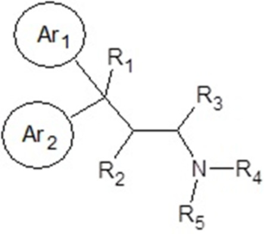

   Die Grundstruktur kann an den in der Abbildung gekennzeichneten Positionen mit den folgenden Atomen, Atomgruppen oder aromatischen Ringsystemen (Reste R
    1                    bis R
    5                   , Ar
    1                    und Ar
    2                   ) substituiert sein:

    a)  R
        1                         :

        Alkylcarbonyl- (Alkylrest bis C
        6                         ), Alkylsulfonyl- (Alkylrest bis C
        6                         ),
        Piperidinyl-1-carbonyl-, Pyrrolidinyl-1-carbonyl- und Morpholinyl-4-carbonylgruppe.

    b)  R
        2                          und R
        3                         :

        Wasserstoff, Methyl- und Ethylgruppen.

    c)  R
        4                          und R
        5                         :

        Wasserstoff und Alkylgruppen (bis C
        4                         ).

        Ferner sind Stoffe eingeschlossen, bei denen das Amin-Stickstoffatom Bestandteil eines Morpholino-, Pyrrolidino- oder Piperidinyl-Ringsystems ist.

    d)  Ar
        1                          und Ar
        2                         :

        Beliebige Kombinationen von Phenyl-, Pyrrolyl-, Pyridyl-, Thienyl- und Furanylringen; die Heteroatome in den Heterozyklen können an jeder beliebigen Stelle des Ringes stehen.

**9.** Von 4-Amino-1-benzylpiperidin abgeleitete Verbindungen ****

    Eine von 4-Amino-1-benzylpiperidin abgeleitete Verbindung ist jede chemische Verbindung, die von einer der nachfolgend abgebildeten Grundstrukturen abgeleitet werden kann, eine maximale Molekülmasse von 500 u hat und mit den nachfolgend beschriebenen Substituenten besetzt sein kann.

    *        *            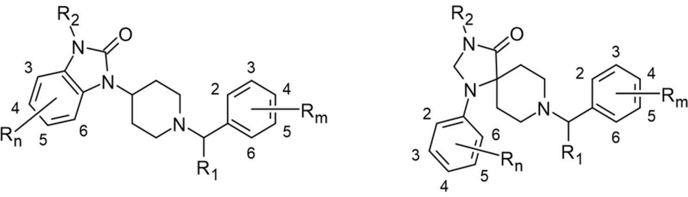

   Die Grundstruktur kann an den in der Abbildung gekennzeichneten Positionen mit den folgenden Atomen, Atomgruppen oder Ringsystemen (Reste R
    1                   , R
    2,                    R
    m                    und R
    n                   ) substituiert sein:

    a)  R
        1                         :

        Wasserstoff, Methyl- und Ethylgruppe.

    b)  R
        2                         :

        Wasserstoff, Methyl-, Ethyl-, Cyanoalkyl- (Alkylrest bis C
        4                         ) und Phenylgruppe.

    c)  R
        m                          und R
        n                         :

        Die Phenylringe können an den Positionen zwei bis sechs (beim Benzimidazalonring entfällt die Position 2) mit folgenden Atomen oder Atomgruppen in beliebiger Kombination substituiert sein: Wasserstoff, Fluor, Chlor, Brom, Iod, Alkyl- (bis C
        6                         ), Alkoxy- (bis C
        5                         ), Acetoxy-, Alkylsulfanyl- (bis C
        5                         ), Hydroxy- und Cyanogruppen. Die vorgenannten Atomgruppen können mit folgenden Atomen und Atomgruppen substituiert sein: Wasserstoff, Fluor, Chlor, Brom, Iod, Alkyloxy- (Alkylrest bis C
        4                         ) und Trialkylsilylgruppen (maximal zwölf C-Atome in den Trialkylresten insgesamt).

        Ferner sind Stoffe eingeschlossen, bei denen in R
        n                          zwei benachbarte Kohlenstoffatome der Positionen 2, 3, 4, 5 und 6 mit einer Vinylenoxy- (1-Oxyethen-2-yl-), Methylendioxy-, Ethylenoxy- oder Ethylendioxygruppe überbrückt werden.

